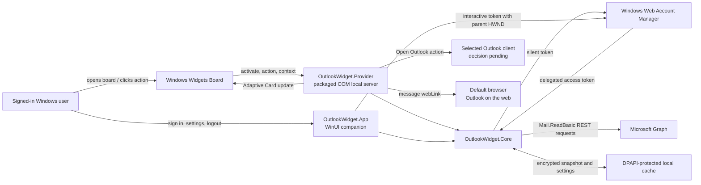

# Outlook Inbox Widget — Technical Plan

Status: **Revised draft — audience decision required before final approval**

Planning date: **2026-07-27**

Implementation status: **Not started**

This plan describes a lightweight Windows 11 Outlook inbox widget for a single Microsoft 365 tenant. It incorporates the decisions approved during planning:

- Use a **gated native-first architecture**: a Windows Widgets Board provider plus a small companion app.
- Fall back to a tray/popover app only if the Phase 0 native-widget gates fail.
- Show sender, subject, received time, and unread status, but never message bodies or body previews.
- Provide a counts-only privacy setting and use counts-only rendering at the small widget size.
- Render cached data first, refresh on activation, and use a five-minute timer only opportunistically while the provider remains active; do not install an always-running startup process in v1.
- Use a single-tenant, delegated, secretless Entra application.
- Make Focused unread count opt-in and dependent on a successful proof-of-concept query.
- Treat New Outlook launch through `olk.exe` as a Phase 0-tested path rather than a guaranteed contract; open individual messages through the documented Graph `webLink`.

## 0. Requirements baseline and unresolved audience decision

### Problem to solve

Give a Windows 11 user a glanceable, privacy-bounded view of the selected Microsoft 365 Inbox without opening Outlook: authoritative Inbox counts plus the newest three to five email messages, with user-initiated paths into Outlook or Outlook on the web.

### Provisional success criteria

- On a supported, policy-enabled device, a signed internal MSIX installs and exposes a pinnable widget.
- A recycled or restarted provider restores every pinned widget instance without requiring the user to interact.
- Cached content renders promptly, then refreshes when activation and platform lifetime permit.
- The app requests only delegated `Mail.ReadBasic`; it never requests, caches, displays, or logs message bodies.
- Authentication UI appears only in the companion app after a user action.
- Install and troubleshooting output distinguishes unsupported OS, Widgets disabled by policy, broker unavailable, consent blocked, mailbox unavailable, and Outlook-client launch failure.

### Decision required before Phase 0

The target cohort is still unspecified. Final approval requires:

- Intended audience and approximate user count: one person, a limited pilot, or a broader internal fleet.
- Outlook-client mix: all New Outlook, mixed New and Classic Outlook, or browser-first.

This affects whether managed MSIX deployment is justified and whether the primary click behavior can remain New-Outlook-only. The plan does not assume that Classic Outlook users should install or repair New Outlook. If the target cohort is mixed, Phase 0 must add a user-selectable New Outlook / Classic Outlook / web launch policy and test each supported choice before the main-action design is approved.

Scale is otherwise not a v1 engineering concern: the product is local, delegated, read-only, and has no hosted service. User count changes deployment and support work, not the Graph/data architecture.

## Confirmed facts and unresolved behavior

The plan deliberately separates documented behavior from behavior that must be tested.

### Confirmed by current Microsoft documentation

- Third-party Windows widgets can be supplied by a packaged Win32 app or a PWA. The current native host is the Windows Widgets Board.
- A packaged Win32 widget registers through the package manifest and is activated by the Widgets host.
- A provider implements all six `IWidgetProvider` methods: `CreateWidget`, `DeleteWidget`, `Activate`, `Deactivate`, `OnActionInvoked`, and `OnWidgetContextChanged`.
- On process construction, the documented C# pattern calls `WidgetManager.GetDefault().GetWidgetInfos()` and restores each enabled widget ID, definition, `CustomState`, and per-instance context. This is required recovery after restart or provider recycle.
- A widget provider can update its widgets at any time and receives `Activate` and `Deactivate` callbacks, but Microsoft warns that the active interval can be short and does not guarantee a recurring refresh interval.
- WAM/MSAL supports brokered authentication, Conditional Access, MFA, Windows Hello, FIDO, and silent token acquisition. Interactive WAM authentication needs an interactive user session, a visible parent window, and a user-initiated action.
- MSAL can fall back to a browser when WAM is unavailable. The provider therefore must expose only silent token acquisition and must fail closed instead of invoking any interactive API.
- Device policy can disable the entire Widgets experience through `NewsAndInterests/AllowNewsAndInterests` or the corresponding **Allow widgets** Group Policy.
- Delegated `Mail.ReadBasic` is the least-privileged permission for the required mail-folder and message reads. It excludes bodies, body previews, attachments, and extended properties.
- `mailFolder.unreadItemCount` directly supplies the Inbox unread count.
- A message exposes `inferenceClassification`, `isRead`, sender/from, subject, received time, and an Outlook-on-the-web `webLink`.
- Microsoft Support currently lists `olk.exe` switches for New Outlook, but the stability and resolution of the bare launch command is treated as a Phase 0 compatibility test. No documented Inbox-selection or message-selection switch is assumed.
- Signed MSIX packages can be sideloaded, and Intune supports signed MSIX deployment.

### Must be proven during Phase 0

- The exact minimum supported Windows 11 build for the intended fleet. Current documentation confirms the Widgets Board requirement but does not state a single clear current minimum build for every third-party-widget scenario. The initial support baseline will therefore be Windows 11 24H2, build 26100 or later.
- Stable provider discovery and COM activation from a signed sideloaded package on representative managed and unmanaged PCs.
- Provider startup recovery for multiple pinned instances using `GetWidgetInfos()` and `CustomState`, including normal exit after the final instance is deleted and a later host-driven restart.
- Silent WAM token acquisition from the provider process after the user authenticated in the companion process.
- Accuracy, latency, and supported syntax of the proposed Focused unread count query.
- Whether a Widget Board action can reliably launch `olk.exe` and the companion app.
- Whether any supported system association hands a Graph `webLink` into New Outlook. The product will not depend on this.
- Actual provider lifetime and cached-first refresh behavior across Board open/close, restart, sleep, sign-out, and package update.
- Target-device Widgets policy, tenant user-consent policy, and the target cohort's installed Outlook-client mix.

Primary sources:

- [Windows widget providers](https://learn.microsoft.com/en-us/windows/apps/develop/widgets/widget-providers)
- [Implement a C# widget provider](https://learn.microsoft.com/en-us/windows/apps/develop/widgets/implement-widget-provider-cs)
- [Widget provider package manifest](https://learn.microsoft.com/en-us/windows/apps/develop/widgets/widget-provider-manifest)
- [MSAL.NET with WAM](https://learn.microsoft.com/en-us/entra/msal/dotnet/acquiring-tokens/desktop-mobile/wam)
- [Windows taskbar and Widgets policy settings](https://learn.microsoft.com/en-us/windows/configuration/taskbar/policy-settings)
- [Microsoft Graph permissions reference](https://learn.microsoft.com/en-us/graph/permissions-reference)
- [Get a mail folder](https://learn.microsoft.com/en-us/graph/api/mailfolder-get?view=graph-rest-1.0)
- [List messages](https://learn.microsoft.com/en-us/graph/api/user-list-messages?view=graph-rest-1.0)
- [Message resource](https://learn.microsoft.com/en-us/graph/api/resources/message?view=graph-rest-1.0)
- [Microsoft Graph error responses](https://learn.microsoft.com/en-us/graph/errors)
- [Architecture changes in new Outlook, including `olk.exe` modes](https://learn.microsoft.com/en-us/microsoft-365-apps/outlook/administration/architecture-changes-new-outlook)

## 1. Recommended architecture

Build one signed MSIX containing:

1. A small C# WinUI 3 companion application for sign-in, logout, account switching, privacy settings, diagnostics, and recovery.
2. An out-of-process C# widget provider registered in the package manifest.
3. A shared .NET library containing authentication coordination, Graph REST calls, refresh rules, cross-process cache coordination, data models, and metadata-free operational logging.

The widget uses Adaptive Cards schema **1.5** rather than the newer HTML-widget option. The required layout is small and bounded; Adaptive Cards avoid an unnecessary browser-rendering layer and reduce script, dependency, and content-security concerns.

Graph will be called directly with `HttpClient`, `System.Text.Json`, and MSAL.NET. The generated Microsoft Graph SDK is unnecessary for three small read-only requests and would materially increase the dependency surface.

The native provider is conditional on the Phase 0 gates. If a critical gate fails, retain the shared core and companion settings UI and replace the provider surface with a system-tray icon and compact popover.

### Alternatives considered

| Option | Fit | Decision |
|---|---|---|
| Native Widgets Board provider | Best match for the requested glanceable Windows experience; supported, but requires packaging, COM activation, and lifecycle testing | **Recommended, gated by Phase 0** |
| System tray plus popover | Predictable process lifetime and refresh; straightforward Outlook launch; not a true Widgets Board experience | **Fallback** |
| Borderless desktop window | Rich and controllable, but consumes desktop space and requires positioning/multi-monitor behavior | Not selected |
| Ordinary taskbar companion | Can be pinned like any app, but Windows exposes no equivalent rich third-party taskbar widget surface | Not selected |
| PWA or PWA-driven widget | Supported in principle, but adds a web runtime and weaker alignment with WAM, packaged companion behavior, and internal desktop deployment | Not selected |
| PowerToys Command Palette extension/Dock | Supported extension model, but requires PowerToys to run and is command/page oriented rather than a 3–5-message widget | Optional future integration |

PowerToys source: [Command Palette extension model](https://learn.microsoft.com/en-us/windows/powertoys/command-palette/extensibility-overview).

## 2. Architecture diagram



## 3. Component breakdown

### OutlookWidget.App

- WinUI 3 companion/settings application.
- Owns every interactive authentication operation.
- Displays account, last successful refresh, Graph/permission status, installed New Outlook status, and sanitized diagnostics.
- Settings:
  - Show or hide message details.
  - Enable Focused unread count after the feature passes its gate.
  - Sign in, switch account, logout.
  - Clear cached mailbox data.
  - Test “Open New Outlook.”
- No mailbox body viewer and no embedded web browser.

### OutlookWidget.Provider

- Out-of-process widget provider registered as `com.microsoft.windows.widgets`.
- Implements the complete `IWidgetProvider` contract:
  - `CreateWidget`: add the instance keyed by widget ID, persist only minimal non-mail `CustomState`, render cached content, and schedule an eligible refresh.
  - `DeleteWidget`: remove the instance; when no enabled instances remain, unregister the COM class object and exit cleanly.
  - `Activate`: mark only that instance active, render cached content, and begin activation-driven refresh with an opportunistic active timer.
  - `Deactivate`: mark only that instance inactive and stop its timer.
  - `OnActionInvoked`: validate the instance and action verb, then handle refresh/open/settings actions.
  - `OnWidgetContextChanged`: read the new size from that instance's `WidgetContext` and re-render the corresponding small/medium/large card.
- On construction, calls `WidgetManager.GetDefault().GetWidgetInfos()` and rebuilds the in-memory instance map from each `WidgetContext` and `CustomState` before processing callbacks.
- Supports multiple pinned instances at different sizes; size and active state are never global.
- Returns cached content immediately, then refreshes asynchronously when required.
- Handles refresh, Open Outlook, open-message, and open-settings actions.
- Builds its broker-enabled MSAL client with `WithParentActivityOrWindow(() => IntPtr.Zero)` and calls only `AcquireTokenSilent`; Phase 0 must verify this construction on the pinned MSAL/Broker versions.
- Has no reference or code path to `AcquireTokenInteractive`. Broker/UI-required failures become a signed-out, sign-in-required, or broker-unavailable card with an action to open the companion.
- Uses `Action.Execute` for refresh, Outlook, settings, and message actions. A message action carries only its bounded display slot and snapshot generation; it never embeds the Graph `webLink` or message ID in Adaptive Card JSON or `CustomState`.
- On a message action, reloads the referenced snapshot, rejects a stale generation or invalid slot, validates the cached HTTPS `webLink` against the Outlook-host allowlist, and only then asks the system launcher to open it. `Action.OpenUrl` is not used in v1.
- If the action's generation is stale, does not launch anything from either snapshot. It re-renders the currently committed snapshot and briefly shows “Inbox updated — choose the message again.”
- `Program.cs` registers the provider factory with `CoRegisterClassObject`, owns provider process lifetime, revokes registration on shutdown, and exits after the last enabled widget is deleted.
- Avoids widget customization APIs in v1; settings live in the companion, avoiding a currently documented customization-menu bug and keeping the provider smaller.

### OutlookWidget.Core

- `InteractiveAuthService`: companion-only WAM/MSAL configuration with a real WinUI HWND, interactive sign-in, logout, and account switching.
- `SilentAuthService`: provider-safe broker configuration exposing only silent acquisition; it cannot start a browser or authentication UI.
- `GraphMailClient`: the two required reads and optional Focused count.
- `MailboxSnapshotService`: combines Graph responses into one immutable display snapshot.
- `RefreshCoordinator`: package-user-wide named mutex, timeout, debounce, backoff, cancellation, and change notification.
- `ProtectedCache`: DPAPI-protected snapshot and selected MSAL home-account/tenant identifiers, with a generation counter and atomic replacement.
- `OutlookLauncher`: Phase 0-verified launch strategy for the approved client mix.
- `OperationalLogger`: event name, status/category, duration, and record count only; its API has no fields for mailbox or identity metadata.
- Shared rendering models that contain only approved metadata.

### OutlookWidget.Package

- MSIX identity, widget registration, COM registration, icons, screenshots, capabilities, and application entries.
- No broad filesystem, elevation, run-full-trust service, or restricted capability unless Phase 0 proves one is strictly required.

## 4. Authentication and Microsoft Graph flow

1. On first use, the widget displays a signed-out card with an “Open settings to sign in” action.
2. The action opens the companion app.
3. The companion explains why `Mail.ReadBasic` is requested.
4. The user clicks Sign in.
5. The companion builds MSAL with `Microsoft.Identity.Client.Broker`, `WithBroker(...)`, and `WithParentActivityOrWindow(realHwnd)`, then invokes WAM. Entra handles MFA, Conditional Access, consent, Windows Hello, or FIDO as required.
6. The app records only the selected MSAL home-account identifier and tenant identifier in DPAPI-protected state.
7. WAM owns broker token maintenance. The application does not write access or refresh tokens into its own JSON/configuration files.
8. Before every Graph refresh, the companion or provider calls its restricted silent service. The provider never calls an interactive MSAL API; `MsalUiRequiredException` or broker-unavailable failures are terminal for that refresh and cannot fall back to a browser.
9. An access token exists only in process memory for the Graph call.
10. The core fetches Inbox counts and newest messages, validates and bounds the response, creates a snapshot, encrypts it, and updates the widget.
11. If silent acquisition later throws `MsalUiRequiredException`, the widget shows “Sign in required.” If WAM/broker construction or use fails, it shows “Authentication broker unavailable.” Both states open the companion only after a user click.

### Logout

- Call MSAL `RemoveAsync` for the selected account.
- Set an explicit local signed-out state so the provider does not immediately reacquire the Windows operating-system account silently.
- Clear the encrypted mailbox snapshot and selected-account identifier.
- Replace widget content with the signed-out card.
- Logout removes the account from this app’s MSAL cache; it does not remove the Windows account or guarantee removal of an identity-provider browser session. This matches [MSAL cache-clearing behavior](https://learn.microsoft.com/en-us/entra/msal/dotnet/acquiring-tokens/clear-token-cache).

### Account switching

- Initiated only from the companion.
- Use WAM/MSAL interactive account selection.
- Clear the prior mailbox snapshot before displaying data for the newly selected account.
- Never merge data from two accounts into one snapshot.

## 5. Required Entra ID app registration settings

Use one development registration for Phase 0. Create a separate production registration only after the native architecture and intended deployment scale are approved.

| Setting | Value |
|---|---|
| Supported account type | Accounts in this organizational directory only |
| Application type | Public client, mobile and desktop |
| Redirect URI | `ms-appx-web://microsoft.aad.brokerplugin/{client-id}` under Mobile and desktop applications |
| Allow public client flows | Yes |
| Client secret/certificate | None |
| Implicit grant | Disabled |
| API permission | Microsoft Graph delegated `Mail.ReadBasic` only |
| App roles/application permissions | None |
| Owners | Phase 0: named Entra application administrator role owner; production: at least two organizational owners |

Do not add `User.Read` unless a later approved feature calls `/me`. Account display information can come from MSAL’s authentication result rather than a separate profile request.

Before Phase 0, the named Entra application administrator role owner checks the tenant user-consent policy and either confirms user consent for the test account or schedules administrator consent. For internal rollout, an administrator can grant tenant-wide consent to eliminate user prompts and align with tenant policy. This is operational consent, not evidence that the delegated permission intrinsically requires admin consent.

## 6. Required Graph permissions

### `Mail.ReadBasic` — required

Why:

- Reads Inbox folder counts.
- Reads sender/from, subject, received time, read state, Focused classification, IDs, and `webLink`.
- Explicitly excludes message bodies, body previews, attachments, and extended properties.

Admin consent:

- Microsoft marks delegated `Mail.ReadBasic` as not inherently requiring admin consent.
- An organization’s user-consent policy can still require administrator approval.

### `Mail.Read` — not required

It would permit message-body access, which the approved privacy design prohibits.

### `User.Read` — not required

No Graph profile endpoint is needed in v1. Remove the default permission if the portal adds it to a new registration.

### `offline_access` — not a Graph API permission to add manually

MSAL supplies its standard OpenID Connect/offline scopes as part of its protocol behavior. The app requests `Mail.ReadBasic` as its resource scope and lets MSAL handle the protocol scopes.

### Application permissions — prohibited in v1

No daemon identity, client credential, tenant-wide mailbox permission, client secret, or certificate is needed.

## 7. Graph endpoints and example queries

Use `https://graph.microsoft.com/v1.0` only. Do not depend on beta APIs.

### Inbox unread and total counts

```http
GET /v1.0/me/mailFolders/inbox
    ?$select=id,displayName,totalItemCount,unreadItemCount
Authorization: Bearer {delegated-token}
```

`unreadItemCount` is displayed and labeled as **Inbox unread**. It is authoritative for the folder and includes all item types, including meeting requests. The adjacent list is labeled **Newest email messages** and is not expected to reconcile item-for-item with that count.

### Newest five message previews

```http
GET /v1.0/me/mailFolders/inbox/messages
    ?$select=id,subject,from,sender,receivedDateTime,isRead,inferenceClassification,webLink
    &$orderby=receivedDateTime desc
    &$top=5
Authorization: Bearer {delegated-token}
```

The client bounds the result to five even if a malformed response contains more. Empty subjects receive a local “(No subject)” label. If both `from` and `sender` are absent, show “Unknown sender”; no body fallback is requested.

Render `receivedDateTime` in the user's current Windows timezone: messages received on the current local date use the locale's short time; older messages use the locale's short date. Do not render relative strings such as “2 minutes ago,” because cached cards can outlive that label.

### Candidate Focused unread count

```http
GET /v1.0/me/mailFolders/inbox/messages
    ?$count=true
    &$filter=isRead eq false and inferenceClassification eq 'focused'
    &$top=1
    &$select=id
Authorization: Bearer {delegated-token}
```

The product reads `@odata.count`, not the returned message. Phase 0 must verify:

- Filter syntax is accepted for the tenant/mailbox.
- Count agrees with New Outlook for representative mailboxes.
- Latency is acceptable.
- No undocumented header such as `ConsistencyLevel: eventual` is required.

If any check fails, the setting remains unavailable and the total unread count continues normally.

### Request concurrency

Issue the required folder-count and newest-message GET requests concurrently with one cancellation/timeout boundary. If optional Focused count is enabled, it may run as a third concurrent request and its failure does not discard the two required results. Defer Graph `$batch` unless measurements with three or more requests show a meaningful benefit.

### Why not delta queries in v1

Message delta is supported with `Mail.ReadBasic`, but an initial delta round can require walking the Inbox to establish state. Maintaining a synchronized mailbox store is disproportionate to a five-message snapshot. Re-evaluate delta or change notifications only if refresh volume becomes significant during internal rollout.

Sources:

- [Mail folder properties](https://learn.microsoft.com/en-us/graph/api/resources/mailfolder?view=graph-rest-1.0)
- [Message delta](https://learn.microsoft.com/en-us/graph/api/message-delta?view=graph-rest-1.0)
- [Graph throttling and batching](https://learn.microsoft.com/en-us/graph/throttling)

## 8. Widget refresh and caching strategy

### Refresh model and triggers

- The headline model is cached-first and activation-driven. The platform does not promise the provider will remain alive.
- After successful sign-in or account switch.
- On provider `Activate` when the cached snapshot is older than 60 seconds.
- Every five minutes only while the provider remains active; this timer is opportunistic, not a freshness guarantee.
- On the user’s manual Refresh action, with a 15-second debounce.
- After an approved settings change that affects rendering.

### No v1 refresh triggers

- No startup-at-login process.
- No Windows service.
- No scheduled task.
- No cloud webhook, WNS service, Graph subscription, client secret, or hosted backend.
- No polling while the provider is deactivated.

### Refresh algorithm

1. Render the last valid cache immediately.
2. Try to acquire a separate package-user refresh lease with a zero timeout. If another process owns it, skip the duplicate request; readers and state mutations never wait on this lease. For a manual click, preserve/show “Refresh already in progress”; the winning refresh's state-changed event and widget update satisfy the request when it completes. If no completion event or generation change arrives, clear that indicator after 15 seconds and return to the prior cached state with “Refresh status unknown — try again.”
3. Capture the selected account and current state generation, then acquire a token silently.
4. Issue the concurrent Graph GETs with a 10-second overall timeout outside the mutation lock.
5. Validate response types, maximum string lengths, URLs, timestamps, and item count.
6. Acquire the package-user mutation mutex only for the commit. Inside a `try`, re-read account, sign-in state, privacy state, and generation; if any relevant state changed while I/O was in flight, mark the result discarded and select the current committed snapshot or signed-out state as the render source.
7. If state still matches, atomically replace the encrypted snapshot, increment its generation, and select that newly committed snapshot as the render source.
8. Release the mutation mutex in `finally` for success, discard, replace failure, cancellation, or exception. Do not render or signal while holding it.
9. After release, signal the package-user-wide state-changed event only when a state commit succeeded.
10. Update every running widget instance only from the selected committed/signed-out render source using its own current size and privacy setting; never pass a discarded result to a widget update.
11. Record a metadata-free operational outcome event. Own the refresh lease through a separate `try/finally` boundary so success, discard, failure, timeout, and cancellation all release it.

### Cache contents

- Format version.
- Tenant ID and selected MSAL home-account ID, not a user principal name or an additional derived account hash.
- Total and unread counts.
- Optional Focused unread count.
- At most five entries containing display sender name, subject, received time, read state, and message `webLink`.
- Last successful refresh time.

### Cache protection and retention

- Store under the package’s per-user local data directory.
- Encrypt the complete snapshot using Windows DPAPI with `CurrentUser` scope.
- Write via temporary file plus atomic replace.
- Reads are lock-free and open the snapshot explicitly with `FileShare.ReadWrite | FileShare.Delete`. This permits a Windows replace while the provider still holds the prior file open; the reader observes either the prior complete snapshot or the new complete snapshot, never a partially written file. A reader never waits for token acquisition or Graph I/O.
- A dedicated nonblocking refresh lease provides cross-process single-flight. It is held by the winning refresher for the request duration but is never acquired by readers or state mutators.
- Hold the mutation mutex only around local state commits: snapshot replacement, logout, account switching, privacy changes, and cache clearing. A refresh must compare the captured account/state generation again under this mutex before committing so an in-flight request cannot resurrect data after logout or overwrite a newer setting.
- Catch `AbandonedMutexException` for both the zero-timeout refresh-lease acquisition and mutation-mutex acquisition. The exception means the caller acquired the abandoned mutex: record only an operational abandoned-lock category, treat protected state as suspect, remove any orphaned temporary snapshot under the mutation mutex, validate the last committed state/cache, and then proceed or discard/refetch as validation requires. Track ownership explicitly and release the acquired mutex in `finally`.
- If atomic replacement encounters a Windows sharing violation from an unrelated handle such as antivirus, indexing, or a debugger, retry at most three times with bounded local backoff (25 ms, 50 ms, then 100 ms) while retaining the mutation mutex. If all attempts fail, retain the prior snapshot, remove the temporary file when possible, record only the operational failure category, and retry on the next approved refresh trigger.
- The companion increments the generation and signals the named event after logout, account switch, privacy change, or cache update. The provider listens only while running and always rechecks the generation on `Activate` and before rendering.
- Clear on logout, account switch, explicit cache-clear, corruption, or unsupported format version. This reconstructible cache has no migration path: delete and refetch.
- After 24 hours without a successful refresh, suppress message details and show a stale/reconnect state rather than presenting old subjects as current.

Windows concurrency/file-sharing sources:

- [.NET `File.Replace`](https://learn.microsoft.com/en-us/dotnet/api/system.io.file.replace)
- [Win32 moving and replacing files](https://learn.microsoft.com/en-us/windows/win32/fileio/moving-and-replacing-files)
- [.NET `AbandonedMutexException`](https://learn.microsoft.com/en-us/dotnet/api/system.threading.abandonedmutexexception)

## 9. Outlook launch and deep-link strategy

### Open Outlook

Primary behavior remains conditional on the audience decision:

- If all target users run New Outlook, use `olk.exe` only after Phase 0 confirms bare-command resolution on supported builds.
- If the cohort is mixed, expose a companion setting for New Outlook, Classic Outlook, or web and test each selected path; never tell a Classic Outlook user that New Outlook must be repaired.
- Detect and report launch failure.
- Do not silently substitute a different client from the user's approved/default policy.

Phase 0 will compare:

- App execution alias resolution.
- Package activation discovered from the installed `Microsoft.OutlookForWindows` package.
- Behavior when New Outlook is already open, updating, missing, or corrupt.

The implementation will select the least brittle supported method demonstrated on current client builds. It must not hard-code a versioned `C:\Program Files\WindowsApps\Microsoft.OutlookForWindows_<version>...` path.

### Open Inbox

Microsoft currently documents no New Outlook Inbox-selection command. Launching New Outlook may restore its current/default view. “Open directly to Inbox” remains an explicit unknown for New Outlook, not a v1 guarantee. Any Classic Outlook Inbox switch is supported only if the mixed-client branch is approved and verified.

### Open an individual message

- Open the Graph-provided `webLink` through the system HTTPS handler.
- This is documented to open Outlook on the web and may request browser sign-in.
- Do not transform message IDs into undocumented URLs.
- Do not claim that the link will open New Outlook.
- Phase 0 records whether current New Outlook app-link registration produces a client handoff, but that behavior remains opportunistic until Microsoft documents it.

### Failure behavior

- Selected client missing: open a companion recovery page that identifies the selected client and offers a settings change or web fallback.
- Failed `webLink`: offer the Outlook on the web Inbox URL and the configured Open Outlook action.
- Never log the message URL because it can contain sensitive identifiers.

## 10. Error handling and offline behavior

| Condition | Widget behavior | Recovery |
|---|---|---|
| No account | Signed-out card | User opens companion and signs in |
| `MsalUiRequiredException` | “Sign in required” while hiding stale details | User-initiated WAM sign-in |
| WAM/broker unavailable | “Authentication broker unavailable”; no browser opens | Companion diagnostics and interactive recovery only |
| Conditional Access/MFA challenge | No background prompt | Companion handles the interactive challenge |
| HTTP 401 | Discard the access-token result and attempt silent reacquisition once | Provider fails closed to “Sign in required”; only the companion may start user-initiated interactive recovery |
| HTTP 403 | “Mailbox access needs approval” | Companion shows tenant/admin guidance |
| HTTP 404 with Graph `error.code` `MailboxNotEnabledForRESTAPI` | “This account has no supported Exchange Online mailbox” | Use a supported mailbox or contact the tenant administrator |
| Graph `error.code` `ErrorItemNotFound` | Treat the affected folder/message as changed or unavailable | Refresh the snapshot; do not expose raw service text |
| HTTP 429 | Keep cache and show delayed refresh status | Honor `Retry-After`; otherwise exponential backoff with jitter |
| HTTP 5xx/timeout/offline | Keep cache with stale timestamp | Retry on next approved trigger |
| Optional Focused query failure | Omit Focused count | Do not fail main snapshot |
| Invalid response/cache | Do not render unvalidated strings | Discard invalid data and refresh |
| Manual refresh while another refresh owns the lease | Keep/show “Refresh already in progress” | Winning refresh updates the widget; without an event/generation change, self-clear after 15 seconds to cached state with “Refresh status unknown — try again” |
| Refresh lease or mutation mutex is abandoned | Treat protected state as suspect; never crash on the exception | Accept acquired ownership, clean temporary state, validate committed state/cache, proceed or refetch, and release in `finally` |
| Message action references a stale snapshot generation | Do not open any cached URL | Re-render current snapshot and briefly show “Inbox updated — choose the message again” |
| Snapshot replace remains blocked after bounded retries | Keep the prior valid snapshot | Record an operational cache-commit failure and retry on the next approved trigger |
| Selected Outlook client missing | Settings/recovery action | Change client choice, install the selected client, or use web |

Manual refresh should remain responsive and must not create parallel requests. After repeated failures, backoff state persists for the provider session, while an explicit manual refresh may make one controlled retry.

## 11. Privacy and security considerations

- Delegated access only; no application access to other mailboxes.
- No password handling, password storage, ROPC, or client secret.
- WAM is the primary broker and supports tenant Conditional Access and MFA.
- Access tokens exist only in memory for API calls.
- Refresh-token maintenance remains with WAM/MSAL.
- Mail cache is DPAPI-protected for the current Windows user.
- Small widget size always shows counts only.
- “Hide message details” converts all sizes to counts-only.
- No message body, `bodyPreview`, attachment, recipient list, or extended property is requested.
- Widget text is treated as untrusted data: length-bound, control-character sanitized, and data-bound into a fixed Adaptive Card template rather than interpolated into executable content.
- HTTPS links are accepted only from expected Outlook hosts returned by Graph; other schemes and unexpected hosts are rejected.
- No telemetry leaves the device in v1.
- Local operational logs contain only event name/ID, UTC timestamp, status category or HTTP status, duration, and record count.
- The logging API accepts no sender, subject, tenant/domain, user/account, message/link, token/header, raw request/response, correlation ID, or exception-dump field. This “no metadata logging” rule is enforced by API shape and code review, not a growing redaction subsystem.
- Keep one small bounded rolling log. An explicit diagnostic export copies that same metadata-free log without a second filtering pipeline.
- Logout clears this app’s token-cache account and local mailbox data, but does not delete the Windows account or global browser/WAM session.
- Phase 4 owns uninstall and consent-revocation testing and documentation, including the fact that uninstall removes package-local cache/settings but does not revoke tenant consent or remove the Windows/WAM account.

## 12. Project folder structure

The repository already exists on `main` with one initial commit and `.gitattributes`. Commit and push `TECHNICAL_PLAN.md` and `TECHNICAL_PLAN-review.md` before relocation so no planning artifact depends on the old working directory. Before Phase 0, relocate the working clone to a short, non-OneDrive path. Preserve Git history and verify the remote after the move; do not reinitialize the repository.

```text
OutlookWidget.sln
Directory.Build.props
Directory.Packages.props
nuget.config
.editorconfig
.gitignore
README.md
src/
  OutlookWidget.App/
    Views/
    ViewModels/
    Services/
    Assets/
  OutlookWidget.Provider/
    Program.cs
    WidgetProvider.cs
    ProviderFactory.cs
    Cards/
  OutlookWidget.Core/
    Authentication/
    Graph/
    Caching/
    Models/
    Refresh/
    Launching/
    Diagnostics/
  OutlookWidget.Package/
    Package.appxmanifest
    Assets/
tests/
  OutlookWidget.Core.Tests/
  OutlookWidget.IntegrationTests/
docs/
  app-registration.md
  troubleshooting.md
scripts/
  Test-PackagePrerequisites.ps1
  Install-DevelopmentPackage.ps1
  Test-OutlookLaunch.ps1
```

Keep the Phase 0 spike in the same solution and evolve it into production code only after its evidence is reviewed; do not create a disposable second architecture that obscures what was tested.

## 13. Development prerequisites

Reconfirm stable versions immediately before scaffolding. As of the planning date:

- Windows 11 24H2 build 26100 or later for the initial supported/tested baseline.
- New Outlook installed on at least one test PC.
- Current Visual Studio 2022 with the WinUI application development workload.
- Current stable Windows SDK.
- .NET 10 LTS with the current security patch.
- Windows App SDK 2.3.1 stable; do not use Preview or Experimental packages.
- Centrally pinned `Microsoft.Identity.Client` and `Microsoft.Identity.Client.Broker` packages.
- Repository-scoped `nuget.config` containing only approved package feeds and package-source mapping where practical.
- Developer Mode on development PCs.
- Access to create or use the development Entra app registration.
- A named Entra application administrator role owner and a confirmed tenant consent path.
- A test mailbox with Focused Inbox enabled and enough read/unread messages for query verification.
- A second account or test user for switch/logout testing.
- A managed test device for Conditional Access, signing, and Intune/RMM validation.

Current-version sources:

- [Windows App SDK downloads](https://learn.microsoft.com/en-us/windows/apps/windows-app-sdk/downloads)
- [.NET support policy](https://dotnet.microsoft.com/en-us/platform/support/policy/dotnet-core)
- [Windows version and SDK overview](https://learn.microsoft.com/en-us/windows/apps/get-started/versioning-overview)

## 14. Local build and debugging workflow

1. Confirm the plan and its review are committed and pushed, then move or freshly clone the repository outside OneDrive before scaffolding (for example, to a short local source path); confirm `git status`, history, and `origin`.
2. Create a feature branch per implementation phase.
3. Restore only centrally pinned dependencies from the feeds allowed by `nuget.config`.
4. Build x64 Debug.
5. Deploy the signed development package rather than relying on an unpackaged run.
6. Launch the companion normally and attach its debugger.
7. Pin the widget through the Widgets Board.
8. Configure Visual Studio to debug the installed provider when the Widgets host activates it.
9. Use a test mailbox and verify Graph responses through the app’s sanitized diagnostics; do not save raw mailbox responses.
10. Run focused unit/integration tests after each component change.
11. Run the complete test suite and package-install test before each milestone review.
12. Commit logical units such as provider activation, WAM sign-in, Graph snapshot, cache protection, or packaging—not broad mixed commits.

No credentials belong in source control. Tenant and client IDs are identifiers rather than secrets, but development and production values should still be supplied through environment-specific package configuration to prevent accidental cross-environment use.

## 15. Packaging and sideloading process

### Development

- Use a stable package identity and a development-only signing certificate.
- Keep the private development certificate out of the repository and out of OneDrive entirely; prefer the Current User certificate store or a dedicated non-synced local certificate path. Only its public certificate may enter a deployment artifact when required.
- Trust the public development certificate on the test PC.
- Build and sign x64 MSIX.
- Install using the generated app installer flow or a reviewed PowerShell script.
- Verify widget registration, package identity, update, repair, and uninstall.

Windows 11 permits unsigned test packages in restricted scenarios, but this project should test a signed package from the beginning because production/internal deployment requires signing.

### Internal release

- Keep package identity and publisher stable across versions.
- Increment the four-part MSIX version for every release.
- Sign using an enterprise-trusted code-signing certificate or Azure Artifact Signing.
- Produce x64 first; add ARM64 only after an actual device/requirement is identified and tested.
- Decide framework-dependent versus self-contained packaging using measured package size and install reliability during Phase 0:
  - Prefer framework-dependent Windows App SDK for smaller packages when dependency deployment is reliable.
  - Include/install the required runtime dependency through the managed deployment workflow.
  - Use self-contained .NET only if target-device runtime variability causes deployment failures worth the size increase.
- Test upgrade over the previous version.
- MSIX does not install a lower version over a higher one. The v1 rollback runbook is remove the current package, then install the prior signed package. Document that this loses widget pins and package-local cache/settings and requires the user to pin/configure again.

Sources:

- [Sign an MSIX package](https://learn.microsoft.com/en-us/windows/msix/package/signing-package-overview)
- [Sideload line-of-business apps](https://learn.microsoft.com/en-us/windows/application-management/sideload-apps-in-windows)

## 16. Optional Intune or RMM deployment approach

### Intune

- Upload the signed MSIX as a line-of-business application.
- If using an internal/self-signed certificate, deploy its public certificate to the appropriate trust store before assigning the application.
- Assign first to a pilot device/user group.
- Validate whether user or device install context best preserves per-user widget registration in the actual tenant; do not assume this from generic MSIX behavior.
- Expand deployment rings only after provider discovery, WAM, and update tests pass.
- Use the MSIX version for update detection.
- Detection/preflight must report and stop when `./Device/Vendor/MSFT/Policy/Config/NewsAndInterests/AllowNewsAndInterests` is `0` or the corresponding **Allow widgets** GPO is disabled.

Microsoft documents silent signed-MSIX deployment through Intune: [Deploy MSIX with Intune](https://learn.microsoft.com/en-us/windows/msix/desktop/managing-your-msix-deployment-intune).

### RMM

- Preflight Windows build, architecture, sideload policy, certificate trust, Windows App Runtime, Widgets Board policy/state, selected Outlook-client presence, and active interactive user.
- Install dependencies before the main MSIX.
- Use per-user registration when running in the user context. If deploying for all users, use a separately tested provisioning workflow rather than assuming `Add-AppxPackage` is machine-wide.
- Return explicit detection output: package family, installed version, widget registration prerequisites, Widgets policy state, and selected Outlook-client status. If policy disables Widgets, report **widgets disabled by policy** and do not install a native-only package that cannot appear.
- Never pass tokens or credentials through RMM variables.
- Provide idempotent install, update, detection, and uninstall scripts.

## 17. Test plan

### Phase 0 acceptance gates

Preconditions: audience/client mix is approved; the clone is outside OneDrive; the target device permits Widgets; the tenant consent path and Entra role owner are confirmed.

1. Signed MSIX installs without the Store and the widget appears on both representative managed and unmanaged devices.
2. Provider cold activation succeeds after reboot and package update.
3. On process start, `GetWidgetInfos()` restores all pinned IDs, definitions, `CustomState`, and per-instance sizes; deleting the final instance exits cleanly and a later host activation restores service.
4. Two pinned instances at different sizes render and update independently.
5. Widget action launches the companion.
6. The approved Outlook-client action launches without a versioned executable path; any unapproved client mix remains a blocker.
7. Companion WAM sign-in supports MFA/Conditional Access with a real HWND.
8. Provider construction with the pinned Broker dependency and zero parent handle supports silent acquisition after companion exit and PC restart, never opens a browser, and fails closed when broker/UI is required.
9. `Mail.ReadBasic` returns exactly the approved properties and no body data is requested.
10. Focused count agrees with Outlook and meets the latency threshold.
11. Cached-first, activation-driven refresh and cross-process cache invalidation operate across Board activation/deactivation, provider recycle, logout, and privacy changes.

Native architecture proceeds only if gates 1–9 and 11 pass. Gate 10 controls only the optional Focused setting. A tray/popover proof is built only in the fallback branch after a critical native gate fails.

### Automated tests

- Auth state machine: signed out, silent success, UI required, account switch, logout.
- Static provider-auth boundary: provider project has no interactive-auth reference or call.
- Graph request construction and strict `$select`.
- Concurrent required-request handling and optional Focused failure.
- Graph error-code mapping for `MailboxNotEnabledForRESTAPI` and `ErrorItemNotFound`.
- Snapshot validation and maximum lengths/counts.
- DPAPI cache round-trip, corruption/version-discard, and atomic replacement.
- Nonblocking cross-process refresh single-flight, mutation-only mutex scope, and generation/event invalidation across refresh, logout, account switch, and privacy changes.
- A cached reader remains within the warm/cold target while another process is in token acquisition or a 10-second Graph request; it never waits on the refresh lease or mutation mutex held across network I/O.
- Change account/privacy generation during an in-flight request; verify the result is discarded, the mutation mutex is released before the committed/signed-out state renders, and a subsequent logout/privacy/commit operation acquires it successfully.
- With one process holding the snapshot open using `FileShare.ReadWrite | FileShare.Delete`, another process can complete the bounded atomic replacement and generation commit; inject transient sharing violations to verify the 25/50/100 ms retry bound and prior-snapshot fallback.
- A manual refresh that loses the zero-timeout lease shows “Refresh already in progress” and is satisfied by the winning refresh's completion update; without completion, it self-clears at 15 seconds.
- Abandon the refresh lease and mutation mutex from a killed helper process; verify `AbandonedMutexException` is treated as acquired ownership, temporary/committed state is validated, every owned mutex is released, and subsequent refresh/logout/privacy operations succeed.
- Refresh single-flight, 15-second debounce, opportunistic five-minute active timer, cancellation, timeout, and backoff.
- Rendering models for small/medium/large and counts-only privacy mode.
- Adaptive Card schema 1.5 and per-instance size rendering.
- URI/host validation.
- Message actions use slot plus snapshot generation through `Action.Execute`; no `webLink` or message ID appears in Adaptive Card JSON/`CustomState`, and stale/invalid actions cannot launch.
- A stale-generation message action re-renders the current snapshot, shows the “Inbox updated” status, and never launches a URL from the stale or replacement slot.
- Static/logging API review that only event, status, duration, and count fields exist.
- Manifest/static package checks.

### Integration/manual tests

- Windows 11 supported build matrix and x64.
- Light, dark, high-contrast, text scaling, keyboard, narrator, and localization-safe truncation.
- Small: counts only. Medium: three messages. Large: five messages.
- Empty Inbox, 0 unread, 1 message, 5+ messages, missing subject, null `from`/`sender`, long Unicode sender/subject, and meeting-request count mismatch.
- Local-time rendering around midnight/DST and a cached snapshot several hours old.
- Focused Inbox enabled/disabled and optional query failure.
- Offline startup with fresh, stale, corrupt, and absent cache.
- HTTP 401, 403, 429 with `Retry-After`, 5xx, timeout, malformed JSON.
- Sleep/resume, user lock/unlock, network transition, reboot, provider crash.
- Two accounts, switch, logout, consent revoked, password reset, MFA challenge, broker unavailable, and proof that no provider path opens a browser.
- Approved Outlook-client matrix: missing, already open, updating, and damaged; include Classic Outlook only if the audience decision requires it.
- Graph `webLink` with browser signed in/out.
- Install, upgrade, repair, uninstall, reinstall, rollback remove-then-install, consent revocation, residual WAM-account behavior, and certificate failure.
- Widgets allowed, explicitly disabled by policy, and user-disabled where applicable; installer/detection output must distinguish them.
- Intune/RMM pilot on a managed device.

### Nonfunctional targets

- Warm cached activation at or below 500 ms on the reference PC.
- Cold cached activation at or below 2 seconds on the reference PC.
- Normal Graph refresh target under 3 seconds; timeout at 10 seconds.
- At most one refresh in flight per account.
- Provider stops its periodic timer on deactivation.
- Logs expose no API field capable of accepting mailbox or identity metadata.

## 18. Phased implementation roadmap

Each phase ends with a user review before the next begins.

### Phase 0 — feasibility spike

- Audience/client decision, Widgets-policy preflight, consent-policy check, and named Entra role owner.
- Repository relocation outside OneDrive and certificate-storage check.
- Minimal signed MSIX, provider registration, companion activation.
- Complete provider lifecycle skeleton, including COM registration/process lifetime, all six callbacks, `GetWidgetInfos()` recovery, multiple instances, and final-instance exit.
- WAM sign-in and provider silent-token handoff.
- Explicit broker-unavailable/no-browser-fallback proof.
- Exact Graph queries and Focused count comparison.
- Approved Outlook-client launch and message-link behavior report.
- Provider lifecycle and refresh experiment.
- Deliver an evidence table with pass/fail results and captured version/build details.

### Phase 1 — secure core

Phase 1's 2–3 day estimate assumes the accepted Phase 0 provider lifecycle and broker skeleton is retained and evolved in place as required by section 12. Rebuilding that skeleton instead of reusing it requires a revised estimate before Phase 1 begins.

- Final models and interfaces.
- WAM authentication/account lifecycle.
- Direct Graph REST client.
- Snapshot validation.
- DPAPI cache with version-discard recovery; no migration machinery.
- Cross-process refresh/cache coordination and metadata-free operational logging.
- Unit and contract tests.

### Phase 2 — companion and widget experience

- Companion onboarding/settings/diagnostics.
- Adaptive Card 1.5 templates and data binding.
- Small, medium, large, counts-only, signed-out, loading, stale, and error states.
- Refresh and launch actions.
- Accessibility and theme verification.

### Phase 3 — resilience and security hardening

- Backoff, offline behavior, corruption recovery, account switch/logout.
- Link validation and no-metadata logging audit.
- Performance and provider lifecycle tests.
- Conditional Access/MFA test.

### Phase 4 — packaging and deployment

- Production identity and signing.
- Upgrade, rollback, uninstall, consent-revocation, and residual broker-state tests.
- Intune and optional RMM pilot.
- README (including privacy, security, and deployment sections), app-registration guide, troubleshooting guide, and the Phase 0 evidence report.
- Release candidate and final review.

### Fallback branch

If a critical Phase 0 native gate fails, stop native provider work and first build the minimal tray/popover proof on the already-tested, surface-agnostic core. Continue that branch only after the proof is reviewed. Do not maintain both full surfaces in v1.

## 19. Risks, unknowns, and proof-of-concept tests

| Risk/unknown | Impact | Mitigation/test |
|---|---|---|
| Audience size and Outlook-client mix are not approved | Architecture/deployment effort or main click may not fit users | Resolve before Phase 0; test only the approved client policy |
| Widgets is disabled by `AllowNewsAndInterests` policy | Native surface can never appear | Preflight CSP/GPO on representative devices; report and stop before install |
| Current documentation does not give one clear minimum Windows build for all third-party-widget cases | Deployment incompatibility | Baseline on Windows 11 24H2; test fleet builds and record Widgets package versions |
| Sideloaded provider registration/COM activation differs across managed devices | Native widget unavailable | Signed-package gate on unmanaged and managed PCs |
| Provider cannot build/use broker silently without a natural HWND | Background refresh fails or browser UI appears | Zero-handle silent-only provider API; pinned Broker package; fail-closed and no-browser Phase 0 tests |
| Companion and provider race refresh/logout/privacy state | Stale details, mixed accounts, torn cache, blocked activation, or sharing-violation commit failures | Nonblocking refresh lease; readers use `FileShare.ReadWrite \| FileShare.Delete`; bounded replace retry; mutation-only mutex with generation compare/finally release; abandoned-mutex recovery; test both nonblocking reads and commits during an open read |
| Focused count query is unsupported, slow, or differs from Outlook | Wrong optional number | Compare query with real Outlook mailboxes; keep feature off/unavailable on failure |
| New Outlook has no documented Inbox/message selector | Click does not reach desired view | Promise launch only; use documented browser `webLink`; monitor Microsoft documentation |
| `olk.exe` resolution/activation changes | Launch failure after update | Test alias/package activation on multiple New Outlook builds; never hard-code versioned path |
| Widget lifecycle is shorter or more aggressively throttled than expected | Five-minute timer rarely runs and view can age | Cached-first, activation-driven refresh; opportunistic timer; manual refresh |
| Widget Board customization bug/regression | Broken settings UX | Keep v1 settings in companion; avoid `IWidgetProvider2` customization |
| MSIX certificate trust/runtime dependency failures | Install failure | Preflight and pilot; stable signing identity; managed certificate/runtime deployment |
| Subject/sender visible to shoulder surfers | Privacy exposure | Counts-only small size and global privacy toggle; no body preview |
| Tenant blocks user consent | Sign-in blocked | Admin consent/readiness instructions and clear 403/approval state |
| Graph throttling/service outage | Refresh failure | Low request volume, concurrent bounded GETs, cached state, `Retry-After`, backoff |
| Windows Widgets investment/roadmap changes over a 2–3 year horizon | Native surface loses priority despite not being deprecated | Keep auth, Graph, cache, and display models surface-agnostic; exercise fallback only if needed |
| Windows App SDK regression | Provider instability | Stable channel only, version pinning, upgrade tests before dependency updates |
| OneDrive locks output or syncs a private signing key | Intermittent builds or credential exposure | Move clone before Phase 0; keep private certificate in cert store or non-synced path |
| New Outlook is absent on the current development PC | Launch tests impossible locally | Install it on a designated test PC before Phase 0 launch gates |

## 20. Rough effort assessment

Estimate for one experienced Windows/.NET developer, excluding waiting time for tenant administration, signing approval, or managed-device scheduling:

| Phase | Effort |
|---|---:|
| Phase 0 feasibility spike and evidence report | 3–5 developer days |
| Phase 1 secure core and automated tests | 2–3 days, assuming Phase 0 lifecycle/broker code is retained |
| Phase 2 companion plus native widget UX | 3–5 days |
| Phase 3 resilience/security/accessibility hardening | 3–4 days |
| Phase 4 packaging, deployment pilot, and documentation | 4–5 days |
| Total native-first path | **15–22 developer days** |

If the native gates fail early, the tray/popover MVP is estimated at 3–5 days after the reusable core decisions are retained. If failure occurs after significant provider work, add up to two days for surface replacement and revalidation.

The estimate assumes:

- One tenant and one selected mailbox at a time.
- No hosted backend, push notifications, message-body access, shared mailbox support, or Store publication.
- Prompt access to an Entra administrator and a representative managed test PC.

## 21. Documentation deliverables

Implementation is not complete until these documents match verified behavior:

- `README.md`: purpose, audience, screenshots, supported Windows versions, prerequisites, architecture/data-flow summary, privacy/security behavior, deployment/rollback/uninstall summary, build, install, use, and limitations.
- `docs/app-registration.md`: exact single-tenant Entra settings and `Mail.ReadBasic` consent.
- `docs/troubleshooting.md`: WAM, consent, mailbox availability, Widgets policy, widget registration, cache recovery, and Outlook-client launch.
- Phase 0 evidence report: OS, Windows App SDK, Widgets host, Outlook client, MSAL/Broker, policy, consent, and package versions plus pass/fail results for every gate.

Architecture, privacy, security, and deployment details begin as clearly labeled `README.md` sections. Split them into separate documents only if later scope makes the README unwieldy. No `SECURITY.md` is required for this internal v1.

## Final approval gate

This revised draft cannot receive final approval until the intended audience/user count and Outlook-client mix are recorded in section 0. After that edit, approval authorizes Phase 0 implementation in small reviewed steps. It does **not** authorize production deployment, tenant-wide consent, Store publication, or broad internal rollout. Those actions require their own explicit review at the appropriate milestone.
