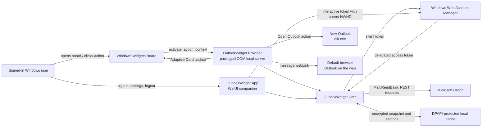

# Outlook Inbox Widget — Technical Plan

Status: **Approved for Phase 0** — single-user v1, New Outlook only. Coordination is a test-first Phase 1 slice 1 (section 18).

Planning date: **2026-07-27**

Implementation status: **Phase 0 in progress; every native-surface gate passes.** Gates 1 through 11 are settled (gate 8 is split), including real Graph refresh, cached-first activation, provider recycle, and cross-process invalidation. Gate 12 is partly measured and needs only its visible count comparison with New Outlook. The section 18 fallback branch is therefore **not** taken.

**Gate 11 passes.** On installed package 0.4.13.2, stale Board activation advanced the protected snapshot, a provider recycle recovered the existing pin and fresh cached generation without another Graph request, and a separate process's state-change signal reached the provider. Gate 4 remains fully verified, including the `CustomState` round trip through the host. Gate 8 is **split**: brokered sign-in passes, self-consent is blocked by the reference tenant's consent policy.

Gate 11 does not affect the fallback decision, because both surfaces consume the same coordination core. **Gate 9 did**, and it passed: a provider that could not acquire a token silently with a zero parent handle would have rendered sign-in-required forever, since interactive authentication belongs only to the companion, whereas a tray/popover UI process could have authenticated itself. It acquired one. **The fallback proof is not being built, and that now rests on evidence rather than on expectation** — the hedge that used to close this paragraph is gone because the measurement replaced it.

**Authentication and the narrow production refresh are built and measured.** Gates 10 and 11 pass. Logout is implemented with suppress-first ordering and a durable signed-out marker, and its installed-package behavior passes on 0.4.19.0; account switching remains unbuilt. Gate 12's query syntax, absence of an undocumented header requirement, and warm latency pass; only comparison of its returned count with New Outlook remains.

**`GraphMailClient` is called in production.** Stale activation, post-sign-in convergence, manual actions, and one provider-wide opportunistic five-minute timer while any widget instance is active run through `MailboxRefreshFetcher` and `RefreshCoordinator`; the validated snapshot is committed through `ProtectedCache`. Timer lifecycle and wiring have automated coverage and are measured on installed package 0.4.18.0: one refresh committed after 324.6 seconds active, while no refresh committed during 340.8 seconds after deactivation with the provider still alive. The settings-change trigger remains a later slice. `docs/phase0-evidence.md` is authoritative for the installed-package measurements.

This plan describes a lightweight Windows 11 Outlook inbox widget for a single Microsoft 365 tenant. It incorporates the decisions approved during planning:

- Use a **gated native-first architecture**: a Windows Widgets Board provider plus a small companion app.
- Fall back to a tray/popover app only if the Phase 0 native-widget gates fail.
- Show sender, subject, received time, and unread status, but never message bodies or body previews.
- Provide a counts-only privacy setting and use counts-only rendering at the small widget size.
- Render cached data first, refresh on activation, and use a five-minute timer only opportunistically while the provider remains active; do not install an always-running startup process in v1.
- Use a single-tenant, delegated, secretless Entra application.
- Make Focused unread count opt-in and dependent on a successful proof-of-concept query.
- Treat New Outlook launch through `olk.exe` as a Phase 0-tested path rather than a guaranteed contract; open individual messages through the documented Graph `webLink`.
- Build v1 for one user on New Outlook only. Preserve the later multi-user option through packaging and identity choices, not by building deployment machinery now.

## 0. Requirements baseline and scope decision

### Problem to solve

Give a Windows 11 user a glanceable, privacy-bounded view of the selected Microsoft 365 Inbox without opening Outlook: authoritative Inbox counts plus the newest three to five email messages, with user-initiated paths into Outlook or Outlook on the web.

### Success criteria

- On a supported, policy-enabled device, a signed internal MSIX installs and exposes a pinnable widget.
- A recycled or restarted provider restores every pinned widget instance without requiring the user to interact.
- Cached content renders promptly, then refreshes when activation and platform lifetime permit.
- The app requests only delegated `Mail.ReadBasic`; it never requests, caches, displays, or logs message bodies.
- Authentication UI appears only in the companion app after a user action.
- Install and troubleshooting output distinguishes unsupported OS, Widgets disabled by policy, broker unavailable, consent blocked, mailbox unavailable, and Outlook-client launch failure.

### Recorded scope decision

- **Audience:** one user — the author — on their own devices. Wider internal use is a possible future, not a v1 requirement.
- **Outlook client:** New Outlook only. Classic Outlook is explicitly out of scope; no Classic Outlook code path, setting, or test is built.
- **Consent:** self-consent to delegated `Mail.ReadBasic` is the designed path and stays so. It is not marked as requiring admin consent, but the tenant's user-consent policy can override that, and **on the reference tenant it did** — self-consent was refused and an administrator granted consent (measured; see the evidence report). Treat that as a local measurement, not as an expectation for other tenants: attempt sign-in first, and involve an administrator only once a sign-in actually returns `ApprovalRequired`. Pre-granting consent would skip the designed flow and make the outcome unknowable.

Scale is not a v1 engineering concern: the product is local, delegated, read-only, and has no hosted service. User count changes deployment and support work, not the Graph/data architecture.

### What single-user scope switches off, and what it deliberately keeps

Out of v1 scope, deferred until the tool is actually shared:

- Managed deployment. Intune and RMM (section 16) stay documented as the future path but are not built, piloted, or tested in v1; installation is a local signed sideload.
- Enterprise code signing. A development certificate trusted on the author's own machines is sufficient; an enterprise-trusted certificate or Azure Artifact Signing belongs to the multi-user step.
- Fleet validation. No managed-plus-unmanaged device matrix, no deployment rings, no separate production Entra registration.

Kept, because these are what make expansion a later decision rather than a rewrite, and each is nearly free now:

- Signed MSIX from the first build. Package identity stays stable across v1 builds, but continuity *into a future enterprise-signed package* is not automatic. v1's stated position is that expansion may mean remove-and-reinstall; the cheaper option — an MSIX persistent-identity bridge built later, when the enterprise certificate exists — stays available only if the development certificate is long-lived and its key is retained. Keeping that option open costs nothing now and is the reason section 15 treats certificate validity and key retention as decisions rather than details.
- The surface-agnostic core, so the tray/popover fallback and any future surface reuse the same auth, Graph, cache, and display models.
- Single-tenant delegated `Mail.ReadBasic` with no secret, and DPAPI-protected local state.
- One Phase 0 evidence report recording the versions and results the multi-user step would otherwise have to rediscover.

## Confirmed facts and unresolved behavior

The plan deliberately separates documented behavior from behavior that must be tested.

### Confirmed by current Microsoft documentation

- Third-party Windows widgets can be supplied by a packaged Win32 app or a PWA. The current native host is the Windows Widgets Board.
- A packaged Win32 widget registers through the package manifest and is activated by the Widgets host.
- A provider implements all six `IWidgetProvider` methods: `CreateWidget`, `DeleteWidget`, `Activate`, `Deactivate`, `OnActionInvoked`, and `OnWidgetContextChanged`.
- On process construction, the documented C# pattern calls `WidgetManager.GetDefault().GetWidgetInfos()` and restores each enabled widget ID, definition, `CustomState`, and per-instance context. This is required recovery after restart or provider recycle.
- A widget provider can update its widgets at any time and receives `Activate` and `Deactivate` callbacks, but Microsoft warns that the active interval can be short and does not guarantee a recurring refresh interval.
- WAM/MSAL supports brokered authentication, Conditional Access, MFA, Windows Hello, FIDO, and silent token acquisition. Interactive WAM authentication needs an interactive user session, a visible parent window, and a user-initiated action.
- MSAL can fall back to a browser when WAM is unavailable. The provider therefore must expose only silent token acquisition and must fail closed instead of invoking any interactive API.
- Device policy can disable the entire Widgets experience through `NewsAndInterests/AllowNewsAndInterests` or the corresponding **Allow widgets** Group Policy.
- Delegated `Mail.ReadBasic` is the least-privileged permission for the required mail-folder and message reads. It excludes bodies, body previews, attachments, and extended properties.
- `mailFolder.unreadItemCount` directly supplies the Inbox unread count.
- A message exposes `inferenceClassification`, `isRead`, sender/from, subject, received time, and an Outlook-on-the-web `webLink`.
- Microsoft Support currently lists `olk.exe` switches for New Outlook, but the stability and resolution of the bare launch command is treated as a Phase 0 compatibility test. No documented Inbox-selection or message-selection switch is assumed.
- Signed MSIX packages can be sideloaded, and Intune supports signed MSIX deployment.

### Must be proven during Phase 0

- The exact minimum supported Windows 11 build for the author's own devices. Current documentation confirms the Widgets Board requirement but does not state a single clear current minimum build for every third-party-widget scenario. The initial support baseline will therefore be Windows 11 24H2, build 26100 or later.
- Stable provider discovery and COM activation from a signed sideloaded package on the author's own PC, which is Entra-managed.
- Provider startup recovery for multiple pinned instances using `GetWidgetInfos()` and `CustomState`, including normal exit after the final instance is deleted and a later host-driven restart.
- Silent WAM token acquisition from the provider process after the user authenticated in the companion process.
- Accuracy, latency, and supported syntax of the proposed Focused unread count query.
- Whether a Widget Board action can reliably launch `olk.exe` and the companion app.
- Whether any supported system association hands a Graph `webLink` into New Outlook. The product will not depend on this.
- Observable Widgets-host delivery semantics: whether `UpdateWidget` blocks, queues, or coalesces, and whether the host offers any ordering guarantee. Record what is observed. Absent a demonstrated guarantee, the plan claims only final convergence and documents the transient-render limitation.
- Actual provider lifetime and cached-first refresh behavior across Board open/close, restart, sleep, sign-out, and package update.
- Target-device Widgets policy, and **whether** self-consent to delegated `Mail.ReadBasic` succeeds against the tenant's user-consent policy. Answered during Phase 0: it does not on the reference tenant.

Primary sources:

- [Windows widget providers](https://learn.microsoft.com/en-us/windows/apps/develop/widgets/widget-providers)
- [Implement a C# widget provider](https://learn.microsoft.com/en-us/windows/apps/develop/widgets/implement-widget-provider-cs)
- [Widget provider package manifest](https://learn.microsoft.com/en-us/windows/apps/develop/widgets/widget-provider-manifest)
- [MSAL.NET with WAM](https://learn.microsoft.com/en-us/entra/msal/dotnet/acquiring-tokens/desktop-mobile/wam)
- [Windows taskbar and Widgets policy settings](https://learn.microsoft.com/en-us/windows/configuration/taskbar/policy-settings)
- [Microsoft Graph permissions reference](https://learn.microsoft.com/en-us/graph/permissions-reference)
- [Configure user consent settings](https://learn.microsoft.com/en-us/entra/identity/enterprise-apps/configure-user-consent)
- [Get a mail folder](https://learn.microsoft.com/en-us/graph/api/mailfolder-get?view=graph-rest-1.0)
- [List messages](https://learn.microsoft.com/en-us/graph/api/user-list-messages?view=graph-rest-1.0)
- [Message resource](https://learn.microsoft.com/en-us/graph/api/resources/message?view=graph-rest-1.0)
- [Microsoft Graph error responses](https://learn.microsoft.com/en-us/graph/errors)
- [Architecture changes in new Outlook, including `olk.exe` modes](https://learn.microsoft.com/en-us/microsoft-365-apps/outlook/administration/architecture-changes-new-outlook)

## 1. Recommended architecture

Build one signed MSIX containing:

1. A small C# WinUI 3 companion application for sign-in, logout, account switching, privacy settings, diagnostics, and recovery.
2. An out-of-process C# widget provider registered in the package manifest.
3. A shared .NET library containing authentication coordination, Graph REST calls, refresh rules, cross-process cache coordination, data models, and metadata-free operational logging.

The widget uses Adaptive Cards schema **1.5** rather than the newer HTML-widget option. The required layout is small and bounded; Adaptive Cards avoid an unnecessary browser-rendering layer and reduce script, dependency, and content-security concerns.

Graph will be called directly with `HttpClient`, `System.Text.Json`, and MSAL.NET. The generated Microsoft Graph SDK is unnecessary for three small read-only requests and would materially increase the dependency surface.

The native provider is conditional on the Phase 0 gates. If a critical gate fails, retain the shared core and companion settings UI and replace the provider surface with a system-tray icon and compact popover.

### Alternatives considered

| Option | Fit | Decision |
|---|---|---|
| Native Widgets Board provider | Best match for the requested glanceable Windows experience; supported, but requires packaging, COM activation, and lifecycle testing | **Recommended, gated by Phase 0** |
| System tray plus popover | Predictable process lifetime and refresh; straightforward Outlook launch; not a true Widgets Board experience | **Fallback** |
| Borderless desktop window | Rich and controllable, but consumes desktop space and requires positioning/multi-monitor behavior | Not selected |
| Ordinary taskbar companion | Can be pinned like any app, but Windows exposes no equivalent rich third-party taskbar widget surface | Not selected |
| PWA or PWA-driven widget | Supported in principle, but adds a web runtime and weaker alignment with WAM, packaged companion behavior, and internal desktop deployment | Not selected |
| PowerToys Command Palette extension/Dock | Supported extension model, but requires PowerToys to run and is command/page oriented rather than a 3–5-message widget | Optional future integration |

PowerToys source: [Command Palette extension model](https://learn.microsoft.com/en-us/windows/powertoys/command-palette/extensibility-overview).

## 2. Architecture diagram



## 3. Component breakdown

### OutlookWidget.App

- WinUI 3 companion/settings application, single-instance, serializing its own disclosure-changing operations.
- Owns every interactive authentication operation, and owns `InteractiveAuthService` itself — the single `AcquireTokenInteractive` call site in the product. See section 12 for why it is here rather than in the core.
- Supplies the real parent window handle that brokered sign-in is parented to. Until Phase 2 converts this project to WinUI 3 that window is a minimal Win32 top-level window created for the purpose, because WAM requires a real handle and the packaging probe's ownerless message box could not provide one.
- Commits state and signals; it never calls `UpdateWidget`. Widget delivery belongs solely to the provider.
- Displays account, last successful refresh, Graph/permission status, installed New Outlook status, and sanitized diagnostics.
- Settings:
  - Show or hide message details.
  - Enable Focused unread count after the feature passes its gate.
  - Sign in, switch account, logout.
  - Clear cached mailbox data.
  - Test “Open New Outlook.”
- No mailbox body viewer and no embedded web browser.

### OutlookWidget.Provider

- Out-of-process widget provider registered as `com.microsoft.windows.widgets`.
- Implements the complete `IWidgetProvider` contract:
  - `CreateWidget`: add the instance keyed by widget ID, persist only minimal non-mail `CustomState`, render cached content, and schedule an eligible refresh.
  - `DeleteWidget`: remove the instance; when no enabled instances remain, unregister the COM class object and exit cleanly.
  - `Activate`: mark only that instance active, render cached content, and begin activation-driven refresh with an opportunistic active timer.
  - `Deactivate`: mark only that instance inactive and stop its timer.
  - `OnActionInvoked`: validate the instance and action verb, then handle refresh/open/settings actions.
  - `OnWidgetContextChanged`: read the new size from that instance's `WidgetContext` and re-render the corresponding small/medium/large card.
- On construction, calls `WidgetManager.GetDefault().GetWidgetInfos()` and rebuilds the in-memory instance map from each `WidgetContext` and `CustomState` before processing callbacks.
- Checks the disclosure tombstone on construction, on `Activate`, on the suppress-details event, and before every render. A present, unreadable, or ambiguous tombstone forces counts-only or the signed-out card regardless of snapshot contents.
- Is the **sole caller of `UpdateWidget`**. It owns one serialized delivery worker with a coalescing depth-one pending marker; each pass re-reads committed snapshot, generation, and tombstone rather than accepting a payload from whoever requested delivery. No two deliveries are ever in flight, and the final rendered content always reflects the newest committed state.
- Supports multiple pinned instances at different sizes; size and active state are never global. Phase 0 measured that the Widgets Board itself permits only one instance per widget definition, so this is currently unobservable through two simultaneous instances — but it remains a requirement rather than dead code, because the host constraint is the host's and may change, and per-instance keying costs nothing.
- Returns cached content immediately, then refreshes asynchronously when required.
- Handles refresh, Open Outlook, open-message, and open-settings actions.
- Builds its broker-enabled MSAL client through `BrokerClient`, passing `BrokerClient.NoParentWindow` — a named member rather than an inline `() => IntPtr.Zero`, so the zero handle is searchable and cannot be chosen accidentally — and calls only `AcquireTokenSilent`. **Verified on the pinned MSAL/Broker versions: this is gate 9 and it passes.**
- Runs its silent acquisition on a background task started **after** `CoRegisterClassObject`, never before. Building the MSAL client opens the shared token cache and a silent acquisition can reach the network, so doing either on the activation path would charge that latency to every cold activation against the section 14 targets, for a result no callback needs in order to render. The task is cancelled and then waited on for a **2-second shutdown bound** before the delivery worker is disposed, after which an unfinished probe is **abandoned** rather than awaited further. That bound is deliberately not the 20-second async deadline: that figure governs a refresh transaction, and using it here delayed process exit by 20 seconds precisely when the broker or token cache was unhealthy, because `BrokerClient.CreateAsync` cannot be cancelled. Do not restore it, and do not claim a stronger shutdown guarantee than abandonment — an unfinished probe has nothing left to deliver to, since the delivery worker is disposed immediately afterwards.
- **Re-probes authentication on the state-changed signal**, not once per process. The provider lives until its last widget is unpinned, so a single probe at startup means the ordinary flow never converges: a widget rendering sign-in-required launches the companion, the user signs in, and the provider holds its original result with a valid token in the broker. Re-probing is signal-driven with an overlap guard — no timer and no background service, per invariant 3 — and it re-probes in both directions rather than only while unauthenticated, so a status that can only improve is not left as a trap.
- Has no reference or code path to `AcquireTokenInteractive`. Broker/UI-required failures become a signed-out, sign-in-required, or broker-unavailable card with an action to open the companion.
- Uses `Action.Execute` for refresh, Outlook, settings, and message actions. A message action carries only its bounded display slot and snapshot generation; it never embeds the Graph `webLink` or message ID in Adaptive Card JSON or `CustomState`.
- On a message action, reloads the referenced snapshot, rejects a stale generation or invalid slot, validates the cached HTTPS `webLink` against the Outlook-host allowlist, and only then asks the system launcher to open it. `Action.OpenUrl` is not used in v1.
- If the action's generation is stale, does not launch anything from either snapshot. It re-renders the currently committed snapshot and briefly shows “Inbox updated — choose the message again.”
- `Program.cs` registers the provider factory with `CoRegisterClassObject`, owns provider process lifetime, revokes registration on shutdown, and exits after the last enabled widget is deleted.
- Avoids widget customization APIs in v1; settings live in the companion, avoiding a currently documented customization-menu bug and keeping the provider smaller.

### OutlookWidget.Core

- `BrokerClient`: the one broker-enabled MSAL client construction both processes use, differing only in the parent-window delegate they pass. Current Microsoft documentation requires a parent window handle on the *builder* in order to use the broker at all, not merely on the interactive call, so both surfaces need the same configuration and the only legitimate difference between them is what that delegate returns. It also attaches the shared token cache, and it contains no interactive acquisition.
- `SilentAuthService`: provider-safe silent-only acquisition; it cannot start a browser or authentication UI. Tries the cached account first and falls back to the operating-system account, in the order Microsoft documents.
- `AuthenticationFailures`: maps MSAL failures onto the product's outcome states, classifying by exception type where MSAL provides one and by error code only for the broker-unavailable and consent cases, which have no dedicated type. Branches on exception text; never logs or returns it.
- `InteractiveAuthService` **lives in `OutlookWidget.App`, not here.** This is a deliberate change from the original layout, recorded in section 12.
- `GraphMailClient`: the two required reads and optional Focused count, hand-written over `HttpClient` rather than through the Graph SDK — three GETs against `v1.0` is the whole surface, and a client that cannot express `body` is a stronger privacy guarantee than an SDK model that can and chooses not to. Concurrent, under one `GraphRequestTimeout` linked to the caller's deadline. Each request is reduced to a value rather than a faulted task, which is what makes the optional Focused count optional in *failure* as well as in absence. Failures are classified by section 10's named `error.code` where the response carries one — `MailboxNotEnabledForRESTAPI` and `ErrorItemNotFound` become their own states — and by HTTP status otherwise. That is the one narrowing of the no-response-content rule, and it is bounded: a capped read, a closed allowlist of two codes, and a `GraphMailStatus` returned rather than a string, so no service text can escape even by accident. Nothing else about a response leaves it but a status code.
- `GraphResponseReader`: the section 8 step 5 validation boundary — response types, string lengths, URL scheme, timestamps, and item count — in one internal file, refusing without describing the fault, because the only thing that could describe it is the response text.
- **`MailboxSnapshotService` was not built as a service.** Combining a readout with the tenant, the selected account, and the refresh time is one construction with nothing to configure and no state to hold, so it is `MailboxSnapshot.Create` instead. A type whose only member is a static factory is a namespace with extra steps. Recorded as a deviation rather than left to look like an omission.
- `RefreshCoordinator`: synchronous package-user named mutex for commits, an expiring lease record for cross-process single-flight, overall deadline, debounce, backoff, cancellation, and change notification. No named primitive is held across an `await`.
- `ProtectedCache`: DPAPI-protected snapshot and selected MSAL home-account/tenant identifiers, with a generation counter and atomic replacement.
- `StateChangeListener`: creates the two named notification events and turns either signal into a callback. Required rather than optional: the signalling side opens the events by name and treats absence as "no listener", so without something creating them every cross-process signal is a silent no-op.
- `SelectedAccountStore`: records which MSAL home account the user actually chose, written by the companion on a successful interactive acquisition and read by `SilentAuthService` in both processes. Its own file rather than part of the snapshot, because silent acquisition needs it *before* any refresh has succeeded and a cleared snapshot must not take it with it. DPAPI-protected, as step 6 of section 4 requires; it holds an opaque directory object ID and the registration it is scoped to, with no mailbox content, no user principal name, and no token. **It fails closed on anything but a clean absence.** A recorded selection that is no longer cached produces interaction-required rather than a fallback to another account, and so does a record that exists and cannot be trusted — unreadable, corrupt, undecryptable, or carrying no identifier. A genuinely missing file permits the first-cached-account fallback **only while exactly one account is cached**: with more than one there is nothing to distinguish a fresh install from a sign-in whose selection failed to persist, so the ambiguity itself refuses. Collapsing "unreadable" into "no selection" is the specific mistake here, because on a machine with more than one cached account it reads a different mailbox and looks exactly like success; this store's direction is therefore the **opposite** of `AuthorizationStateStore`'s, where an unreadable record must yield no refinement because over-claiming withdraws a retry the user may want. Same shape of question, opposite harms.
- `AuthorizationStateStore`: carries a terminal interactive authorization outcome from the companion to the provider. Required rather than convenient, because one state is not rediscoverable by design: classification is phase-aware, so a consent failure during *silent* acquisition is reported as interaction-required deliberately, and the provider — which only acquires silently — can therefore never conclude approval-required on its own. Only the companion learns it, by being refused interactively. Not DPAPI-protected: it holds a status enum, a timestamp, and the tenant and client IDs of the registration it is scoped to, in the clear — with no mailbox content, account, or token. Those identifiers add no exposure the package did not already have, because `authentication.json` ships both beside the two executables; they are recorded because consent is granted to a specific application in a specific tenant, so a record without them is not about anything. Refines interaction-required only, so a stale record can never override a working token and needs no expiry.
- `StateChangeSignal`: raises the state-changed event, extracted so the open-by-name-and-tolerate-no-listener mechanism exists once. `StateCommitCoordinator` still signals only after a successful commit; the companion also signals after a successful sign-in, which is state that is real, changes what the provider can do, and changes no snapshot generation. Without it a pinned widget holds its original authentication result until unpinned, because the provider outlives the sign-in.
- `OutlookLauncher`: Phase 0-verified New Outlook launch strategy. No Classic Outlook path.
- `OperationalLogger`: event name, status/category, duration, and record count only; its API has no fields for mailbox or identity metadata.
- Shared rendering models that contain only approved metadata.

### OutlookWidget.Package

- MSIX identity, widget registration, COM registration, icons, screenshots, capabilities, and application entries.
- No broad filesystem, elevation, run-full-trust service, or restricted capability unless Phase 0 proves one is strictly required.

## 4. Authentication and Microsoft Graph flow

1. On first use, the widget displays a signed-out card with an “Open settings to sign in” action.
2. The action opens the companion app.
3. The companion explains why `Mail.ReadBasic` is requested.
4. The user clicks Sign in.
5. The companion builds MSAL with `Microsoft.Identity.Client.Broker`, `WithBroker(...)`, and `WithParentActivityOrWindow(realHwnd)`, then invokes WAM. Entra handles MFA, Conditional Access, consent, Windows Hello, or FIDO as required. It attempts silent acquisition first and prompts only when that reports interaction is required, per Microsoft's integration guidance; a broker-unavailable or approval-required silent outcome is reported rather than escalated to a prompt that cannot succeed.
6. The app records only the selected MSAL home-account identifier and tenant identifier in DPAPI-protected state.
7. WAM owns broker token maintenance. The application does not write access or refresh tokens into its own JSON/configuration files. MSAL's shared cache holds ID tokens and account metadata only, which is what lets the provider find in a second process the account the companion selected in the first.
8. Before every Graph refresh, the companion or provider calls its restricted silent service. The provider never calls an interactive MSAL API; `MsalUiRequiredException` or broker-unavailable failures are terminal for that refresh and cannot fall back to a browser.
9. An access token exists only in process memory for the Graph call.
10. The core fetches Inbox counts and newest messages, validates and bounds the response, creates a snapshot, encrypts it, commits it, and requests delivery; the provider's delivery worker renders it.
11. If silent acquisition later throws `MsalUiRequiredException`, the widget shows “Sign in required.” If WAM/broker construction or use fails, it shows “Authentication broker unavailable.” Both states open the companion only after a user click.

### Logout

Order matters here, and suppression genuinely goes first — `RemoveAsync` is awaited, so starting with it opens a window in which the provider has been told nothing and still holds a valid cache.

1. Write this operation's disclosure tombstone and set the suppress-details event. Nothing else happens until the provider has been given the means to fail closed.
2. Call MSAL `RemoveAsync` for the selected account.
3. Set an explicit local signed-out state so the provider does not immediately reacquire the Windows operating-system account silently, and commit it under the bounded mutation mutex.
4. Remove this operation's own tombstone only after that commit succeeds, because committed state is authoritative from then on.

Additional behavior:

- Clear the encrypted mailbox snapshot and selected-account identifier.
- Replace widget content with the signed-out card.
- Logout removes the account from this app’s MSAL cache; it does not remove the Windows account or guarantee removal of an identity-provider browser session. This matches [MSAL cache-clearing behavior](https://learn.microsoft.com/en-us/entra/msal/dotnet/acquiring-tokens/clear-token-cache).

### Account switching

- Initiated only from the companion.
- Write this operation's tombstone file and set the suppress event before starting, as for logout; delete only that file, and only after the new account's state is committed.
- Use WAM/MSAL interactive account selection.
- Clear the prior mailbox snapshot before displaying data for the newly selected account.
- Never merge data from two accounts into one snapshot.

## 5. Required Entra ID app registration settings

Use one registration. A separate production registration is a multi-user concern and is created only if the tool is shared beyond the author.

| Setting | Value |
|---|---|
| Supported account type | Accounts in this organizational directory only |
| Application type | Public client, mobile and desktop |
| Redirect URI | `ms-appx-web://microsoft.aad.brokerplugin/{client-id}` under Mobile and desktop applications |
| Allow public client flows | Yes |
| Client secret/certificate | None |
| Implicit grant | Disabled |
| API permission | Microsoft Graph delegated `Mail.ReadBasic` only |
| App roles/application permissions | None |
| Owners | The author; add a second organizational owner only if the tool is shared |

Do not add `User.Read` unless a later approved feature calls `/me`. Account display information can come from MSAL’s authentication result rather than a separate profile request.

Delegated `Mail.ReadBasic` is not marked as requiring admin consent, so self-consent was expected to keep an administrator off the critical path. **Phase 0 measured otherwise and this paragraph is corrected rather than deleted, because the reasoning was sound and the premise was wrong.** The reference tenant's user-consent policy — "Let Microsoft manage your consent settings" with mail-client consent enabled — permits user consent to mail permissions only for a fixed list of Microsoft-chosen mail clients, so a registration of one's own cannot self-consent under it. An administrator granted consent for this registration.

The distinction that paragraph drew still holds and matters more now: admin consent is **operational necessity on some tenants, not evidence that the delegated permission intrinsically requires it.** Nothing about the permission changed, no application permission was added, and the grant covers this one registration's delegated scope. It is also not the multi-user step; that remains section 16 and separately gated.

## 6. Required Graph permissions

### `Mail.ReadBasic` — required

Why:

- Reads Inbox folder counts.
- Reads sender/from, subject, received time, read state, Focused classification, IDs, and `webLink`.
- Explicitly excludes message bodies, body previews, attachments, and extended properties.

Admin consent:

- Microsoft marks delegated `Mail.ReadBasic` as not inherently requiring admin consent.
- An organization’s user-consent policy can still require administrator approval.
- **The approval-required state must survive the companion closing.** The provider cannot derive it: its silent classifier maps consent failures to interaction-required on purpose. So the companion records a terminal approval-required outcome through `AuthorizationStateStore` and signals, and the provider refines its silent result with it. Without that, a pinned card keeps asking for a sign-in that cannot succeed — the same conflation the next bullet forbids, reached through a cross-process gap rather than a classification mistake.
- **A consent-policy block is an authorization failure, not a Graph failure.** If tenant policy prevents self-consent, the failure surfaces during interactive Entra/MSAL authorization — an approval-required or admin-consent-required condition raised before any access token exists — so no Graph call is ever made and no HTTP 403 is returned. Treat it as a distinct state from a Graph 403, which means a token was issued but the mailbox request was refused. Phase 0 and `docs/troubleshooting.md` must name them separately, or a policy change will be misdiagnosed as a permissions bug in the app.

### `Mail.Read` — not required

It would permit message-body access, which the approved privacy design prohibits.

### `User.Read` — not required

No Graph profile endpoint is needed in v1. Remove the default permission if the portal adds it to a new registration.

### `offline_access` — not a Graph API permission to add manually

MSAL supplies its standard OpenID Connect/offline scopes as part of its protocol behavior. The app requests `Mail.ReadBasic` as its resource scope and lets MSAL handle the protocol scopes.

### Application permissions — prohibited in v1

No daemon identity, client credential, tenant-wide mailbox permission, client secret, or certificate is needed.

## 7. Graph endpoints and example queries

Use `https://graph.microsoft.com/v1.0` only. Do not depend on beta APIs.

### Inbox unread and total counts

```http
GET /v1.0/me/mailFolders/inbox
    ?$select=id,displayName,totalItemCount,unreadItemCount
Authorization: Bearer {delegated-token}
```

`unreadItemCount` is displayed and labeled as **Inbox unread**. It is authoritative for the folder and includes all item types, including meeting requests. The adjacent list is labeled **Newest email messages** and is not expected to reconcile item-for-item with that count.

### Newest five message previews

```http
GET /v1.0/me/mailFolders/inbox/messages
    ?$select=id,subject,from,sender,receivedDateTime,isRead,inferenceClassification,webLink
    &$orderby=receivedDateTime desc
    &$top=5
Authorization: Bearer {delegated-token}
```

The client bounds the result to five even if a malformed response contains more. Empty subjects receive a local “(No subject)” label. If both `from` and `sender` are absent, show “Unknown sender”; no body fallback is requested.

Render `receivedDateTime` in the user's current Windows timezone: messages received on the current local date use the locale's short time; older messages use the locale's short date. Do not render relative strings such as “2 minutes ago,” because cached cards can outlive that label.

### Candidate Focused unread count

```http
GET /v1.0/me/mailFolders/inbox/messages
    ?$count=true
    &$filter=isRead eq false and inferenceClassification eq 'focused'
    &$top=1
    &$select=id
Authorization: Bearer {delegated-token}
```

The product reads `@odata.count`, not the returned message. Phase 0 must verify:

- Filter syntax is accepted for the tenant/mailbox.
- Count agrees with New Outlook for representative mailboxes.
- Latency is acceptable.
- No undocumented header such as `ConsistencyLevel: eventual` is required.

If any check fails, the setting remains unavailable and the total unread count continues normally.

### Request concurrency

Issue the required folder-count and newest-message GET requests concurrently with one cancellation/timeout boundary. If optional Focused count is enabled, it may run as a third concurrent request and its failure does not discard the two required results. Defer Graph `$batch` unless measurements with three or more requests show a meaningful benefit.

### Why not delta queries in v1

Message delta is supported with `Mail.ReadBasic`, but an initial delta round can require walking the Inbox to establish state. Maintaining a synchronized mailbox store is disproportionate to a five-message snapshot. Re-evaluate delta or change notifications only if refresh volume ever becomes significant, which one user will not produce.

Sources:

- [Mail folder properties](https://learn.microsoft.com/en-us/graph/api/resources/mailfolder?view=graph-rest-1.0)
- [Message delta](https://learn.microsoft.com/en-us/graph/api/message-delta?view=graph-rest-1.0)
- [Graph throttling and batching](https://learn.microsoft.com/en-us/graph/throttling)

## 8. Widget refresh and caching strategy

### Refresh model and triggers

- The headline model is cached-first and activation-driven. The platform does not promise the provider will remain alive.
- After successful sign-in or account switch.
- On provider `Activate` when the cached snapshot is older than 60 seconds.
- Every five minutes only while the provider remains active; this timer is opportunistic, not a freshness guarantee.
- On the user’s manual Refresh action, with a 15-second debounce.
- After an approved settings change that affects rendering.

### No v1 refresh triggers

- No startup-at-login process.
- No Windows service.
- No scheduled task.
- No cloud webhook, WNS service, Graph subscription, client secret, or hosted backend.
- No polling while the provider is deactivated.

### Two coordination primitives, and why they are not the same thing

`System.Threading.Mutex` is **thread-affine**: the thread that acquires it must be the thread that releases it. An `await` continuation is not guaranteed to resume on the acquiring thread, so a named `Mutex` held across awaited WAM or Graph work can fail to release even inside a correct `try/finally`. The two primitives here are therefore built differently on purpose:

- **Mutation mutex — a real named `Mutex`, never held across an `await`, always acquired with a bounded wait.** Its critical section is entirely synchronous local work: DPAPI protect/unprotect, temp-file write, atomic replace, generation increment. Acquire and release happen on one thread with no suspension point in between, which is exactly the shape `Mutex` supports. `AbandonedMutexException` handling still applies, because a process can be killed mid-commit.

  **Every acquisition uses `WaitOne(timeout)`. The parameterless `WaitOne()` overload is prohibited** — it waits indefinitely, so a peer wedged inside a critical section would hang the caller with no recovery path, which is precisely the failure the lock-free read design exists to prevent. Use a 2-second timeout: the critical section is local synchronous I/O whose worst case is the bounded 25/50/100 ms replace retry, so 2 seconds is generous by an order of magnitude and any timeout indicates a genuinely stuck peer rather than normal contention.

  Timeout behavior differs by caller, and the difference matters:
  - **Refresh commit:** treat as contention failure. Abandon the commit, keep the prior snapshot, record the operational timeout category, and retry on the next approved trigger. Nothing is lost — the snapshot is reconstructible.
  - **Logout, account switch, privacy change, and cache clear:** these must not silently no-op. A logout whose commit was skipped would leave the previous account's subjects on screen, which is a privacy failure rather than a stale-data annoyance. Retry once, and if the second attempt also times out, surface an explicit failure in the companion ("Could not complete sign-out — it will finish when the widget board is closed; try again") and do not report success. Suppression of message details in that window does **not** depend on this mutex; see the disclosure tombstone below.

### Disclosure-reducing changes suppress first, commit second

The mutation mutex cannot be the only path to a fail-closed state, because a wedged peer is exactly when fail-closed matters most. If logout could only hide details by committing signed-out state, incrementing the generation, and signalling the state-changed event, then a mutex timeout would leave the provider with no signal at all and it would keep rendering the prior valid cache — the opposite of the intended behavior.

So any state change that **reduces** what may be displayed — logout, account switch, and switching "hide message details" on — writes a **disclosure tombstone before attempting the mutation**, on a path that needs no mutex:

1. On user intent, the companion writes its operation's tombstone file and sets a named suppress-details event. Neither takes the mutation mutex.
2. The provider treats any present tombstone as an unconditional override: render counts-only, or the signed-out card for logout and account switch, regardless of what the snapshot contains. It checks on `Activate`, on the suppress event, and before every render. A check that fails or is ambiguous counts as suppression — fail closed.
3. The companion then attempts the mutation under the bounded mutex as normal.
4. **On success,** committed state is now authoritative and says signed-out or details-hidden, so the operation deletes **its own** tombstone file after the generation increment and state-changed signal.
5. **On failure after retry,** the tombstone stays. Details remain suppressed, the companion reports explicit failure, and the operation can be retried. Nothing was disclosed while the peer was stuck.

Ordering suppression *before* the risky operation is what makes this work: the safe state is already in place when the operation is attempted, so a timeout leaves safety intact rather than requiring a signal that cannot be sent. A tombstone surviving a crash is also correct — it fails closed until an explicit successful operation clears it.

**One tombstone file per operation — never a single shared file.** A shared file cannot be safely reclaimed. "Read the owner ID, then delete if it matches" is not an atomic conditional delete: operation A can read its own ID, operation B can replace the file, and A can then delete B's tombstone. The non-weakening read-modify-write has the identical lost-update problem. Rather than add a lock to protect the very mechanism that exists to survive a stuck lock, remove the sharing:

- Each disclosure-reducing operation writes **its own file**, named by a per-operation GUID, in a dedicated suppression directory under the package's per-user local data directory. Content records the suppression mode and a creation stamp.
- **An operation deletes only its own file.** There is no conditional delete, no compare step, and therefore no window between check and act. One writer, one file, one deleter.
- **Suppression is active while any file exists**, and the effective mode is the strongest mode among the files present — signed-out over counts-only. Precedence is computed by the provider at read time, so there is no read-modify-write to lose and no way for one operation to weaken another's suppression.
- Enumeration failure, or any file that is present but unparseable, means suppression with the strongest mode. A file appearing after an enumeration is picked up by the next pass or the suppress event, and the provider re-enumerates on `Activate`, on the event, and before every render.
- **The companion remains single-instance and serializes its own disclosure-changing operations.** That is now defence in depth rather than the thing correctness rests on, which is why the overlapping-operations test is meaningful: with per-operation files, overlap is genuinely safe rather than merely unlikely.

Files left by a crashed or killed operation persist and keep suppression active, which is the correct direction. They are cleared by a later successful disclosure-changing commit removing its own file, or by an explicit user action in the companion — surfaced in diagnostics as "message details are suppressed by an interrupted operation" with a clear button, so recovery requires intent rather than happening silently.

Changes that *increase* disclosure — switching "hide message details" back off — need no tombstone and commit normally. There is no safety argument for pre-emptively revealing more.

As defence in depth, note that logout's MSAL `RemoveAsync` does not require this mutex, so the account is typically already gone from the token cache even when the local commit fails. The provider's next silent acquisition then throws `MsalUiRequiredException` and it converges on the signed-out card anyway. The tombstone covers the window before that happens, which is precisely the window in which the stale cache would otherwise be rendered.
- **Refresh lease — a record, not a held lock.** Cross-process single-flight is expressed as a small lease record (owner process ID, owner instance GUID, and an expiry) written under a brief synchronous hold of the mutation mutex. Nothing is held while the refresh runs. Acquiring means: take the mutex, see whether a live unexpired lease exists, write your own if not, release. Releasing means: take the mutex, clear the record if you still own it, release. Both operations are short, synchronous, and single-threaded.

The lease record also makes crash recovery fall out for free: a killed owner leaves an expired record, and expiry alone reclaims it — no `AbandonedMutexException` dependence and no separate watchdog timer.

**Expiry clock.** Record expiry using `Environment.TickCount64`, which is per-boot monotonic and directly comparable across processes on the machine. Because tick counts restart at boot, a record must also carry a boot-session discriminator or a stale post-reboot record could look live.

**Boot-session discriminator.** Windows exposes no managed boot-identity API, so derive one: `bootStamp = UtcNow - TimeSpan.FromMilliseconds(Environment.TickCount64)`, quantized to the nearest 10 seconds and stored as a fixed-format UTC string. `GetTickCount64` includes time spent asleep, so this value is stable within a boot session; quantization absorbs the small jitter between two processes computing it at different moments. A lease whose stored `bootStamp` differs from the reader's is treated as expired regardless of its tick value.

This fails in the safe direction. A large wall-clock correction — NTP step, manual clock change — shifts the computed stamp, so an existing lease stops matching and is treated as expired. The consequence is an early reclaim, at worst allowing one duplicate refresh, which the generation compare at commit already handles. The opposite error, a stale lease appearing live, cannot occur from a clock change because any mismatch reads as expired. Do not substitute wall-clock timestamps for the tick-based expiry itself; the discriminator is the only place wall-clock is used, and only for equality, never for duration.

A named `Semaphore` would avoid thread affinity but not the crash problem — a killed holder never releases its count — so it would need the same expiry machinery with less clarity. If the lease record proves awkward in Phase 1, the alternative is to keep mutex ownership pinned to a dedicated coordinator thread while the async work runs elsewhere; that is more machinery for the same guarantee and should be a deliberate second choice, not a drift.

### Refresh algorithm

1. Render the last valid cache immediately.
2. Try to claim the refresh lease. Take the mutation mutex briefly and synchronously with the 2-second bounded wait, check for a live unexpired lease record, and write your own with expiry = now + the **lease horizon** (30 seconds, see below — deliberately longer than the 20-second async deadline, because the commit that follows it is not cancellable) if none exists; release the mutex immediately either way. A wait timeout here means a peer is stuck; skip this refresh rather than proceeding unsynchronized. If another process holds a live lease, skip the duplicate request; readers and state mutations never wait on the lease. For a manual click, preserve/show “Refresh already in progress” while a live lease exists. The winning refresh's state-changed event and widget update satisfy the request when it completes. Once the lease is cleared or expires with no completion event or generation change, clear the indicator and return to the prior cached state with “Refresh status unknown — try again.” Lease expiry is the watchdog; a killed owner's indicator clears when its record ages out.
3. Start the overall async deadline — 20 seconds, covering silent token acquisition, the Graph requests, and validation. It is a single linked cancellation source, and every *awaited* step observes it. It does **not** bound the commit, which is synchronous and deliberately non-cancellable once entered; see the budget below. Capture the selected account and current state generation, then acquire a token silently under that deadline.
4. Issue the concurrent Graph GETs with a 10-second timeout of their own, nested inside the async deadline, outside the mutation lock.
5. Validate response types, maximum string lengths, URLs, timestamps, and item count.
6. Acquire the mutation mutex only for the commit, with the 2-second bounded wait, and run the whole critical section synchronously with no `await` inside it. On wait timeout, take the refresh-commit path above: keep the prior snapshot, commit nothing, record the timeout category. On the acquiring thread, inside a `try`, re-read account, sign-in state, privacy state, and generation; if any relevant state changed while I/O was in flight, mark the result discarded and select the current committed snapshot or signed-out state as the render source.
7. If state still matches, atomically replace the encrypted snapshot, increment its generation, and select that newly committed snapshot as the render source. Still synchronous, still the same thread.
8. Release the mutation mutex in `finally` on the acquiring thread, for success, discard, replace failure, or exception. Do not render, signal, or await while holding it. Because nothing is awaited inside, cancellation cannot strand the release; a deadline that expires during the commit is observed after release, not inside it.
9. Clear the refresh lease — a second brief synchronous mutation-mutex hold, bounded wait again, removing the record if this process still owns it. This is the end of the refresh transaction, and it happens **before** any widget delivery. The `try/finally` that owns the lease spans steps 2 through 9 only, so success, discard, failure, timeout, and cancellation all reach it; a process killed before it runs is covered by lease expiry. If the wait times out, leave the record alone — expiry reclaims it, so a failed clear degrades to a delayed reclaim rather than a lost lease.
10. Signal the package-user-wide state-changed event, only when a state commit succeeded. This is a notification that committed state changed; it carries no payload.
11. Request delivery. The refresher does **not** call `UpdateWidget` itself — see the delivery-authority rule below. It sets the provider's coalescing pending-delivery marker; if this process is the provider, its delivery worker picks the request up, and if it is the companion, the state-changed event is the request.
12. Record a metadata-free operational outcome event, with refresh outcome and delivery outcome as separate fields.

### What actually bounds a refresh

The 20-second async deadline does not, by itself, bound the operation. Segments sit outside it, and the lease horizon has to cover all of them or a second process could claim the lease while the first is still committing.

The bound covers the **refresh transaction** — steps 2 through 9, claim through lease clear. Widget delivery is excluded on purpose, because it cannot be bounded by this design:

| Segment | Bound | Cancellable? |
|---|---|---|
| Lease claim — mutex wait plus record write | 2 s | Yes, before acquisition |
| Token acquisition, Graph requests, validation | 20 s async deadline | Yes |
| Commit — mutex wait | 2 s | Yes, before acquisition |
| Commit — critical section, including the 25/50/100 ms replace retries | well under 1 s | **No**, by design |
| Lease clear — mutex wait plus record write | 2 s | Yes, before acquisition |
| **Refresh transaction worst case** | **~27 s** | |
| Widget delivery — `UpdateWidget` per instance | **unbounded** | No |

**Why delivery is outside the transaction.** `WidgetManager.UpdateWidget` is a synchronous void call into the Widgets host with no documented timeout and no cancellation. A slow or wedged host would otherwise drag the operation past the 30-second lease horizon, at which point the lease could be reclaimed while its owner was still nominally mid-operation — the exact race the horizon exists to prevent. Clearing the lease first makes delivery genuinely post-transactional, and that is safe: once the snapshot is committed and its generation incremented, a peer that claims the lease finds fresh data and skips under the 60-second activation rule, and if it does refresh anyway the generation compare handles it. Nothing about correctness depends on holding the lease through rendering.

### The provider is the sole delivery authority

Moving delivery out of the lease removes the timing problem but creates an ordering one: with no lease held, two processes could call `UpdateWidget` concurrently, and a slow older call can land *after* a newer refresh, logout, account switch, or privacy commit. Whatever reaches the host last becomes the displayed content, and the generation compare cannot help — it guards the cache, and a payload already handed to `UpdateWidget` cannot be retracted. Ordering must therefore be established before the call, not validated after it.

- **Only the provider calls `UpdateWidget`.** The companion commits and signals; it never delivers. This is also the natural division — the provider is the only process holding widget IDs and per-instance contexts.
- **One serialized delivery worker inside the provider,** with a coalescing pending marker of depth one. Concurrent requests collapse into a single pending flag, so no two `UpdateWidget` calls are ever in flight and there is no interleaving to order.
- **The trigger carries no payload; the worker re-reads committed state.** Each pass performs a fresh lock-free read of the snapshot, its generation, and the tombstone, then builds and delivers cards from *that*. A request generated by an old refresh cannot carry stale content forward, because the content is chosen at delivery time rather than at request time.
- **Latest-generation-wins, as final convergence — not as retraction.** If a request arrives while a pass is delivering, the pending flag is set again and the worker runs one more pass afterwards, so the *final* rendered content always reflects the newest committed state. What this does **not** provide is retraction: `UpdateWidget` is a synchronous void call, and once a payload has entered it, no later tombstone, generation change, or logout can alter or recall that call.
- **Therefore a transient display of pre-change content is possible.** If a pass had already read state and entered `UpdateWidget` when a logout, account switch, or privacy change commits, that older payload can still land — and if the host is wedged, it can land noticeably later, briefly showing the previous account's or pre-suppression content before the follow-up pass replaces it. The exposure window is narrow by construction, because the worker re-reads state and tombstone immediately before the call rather than accepting a payload captured earlier, but it is not zero and the plan does not claim it is.
- **The guarantee is stated as convergence, and the limitation is user-visible.** README must document that a wedged Widgets host can delay privacy-state rendering. Phase 0 records whatever it can observe about host ordering and whether `UpdateWidget` blocks, queues, or coalesces — but no stronger claim than final convergence may be made unless Phase 0 actually demonstrates stronger host semantics.
- **Suppression is re-evaluated per pass**, so every pass that has not yet entered the call honors the current tombstone. This bounds the problem to passes already in flight rather than to any pass requested before the change.

Delivery then gets rules rather than a bound:

- Run the worker so it cannot block the refresh path or subsequent `Activate` handling; a wedged host degrades rendering only.
- Record delivery outcome separately from refresh outcome. "Refresh succeeded, delivery slow or failed" is a real and distinguishable state, and conflating them would hide a host problem behind an apparently failing refresh.
- A wedged Widgets host is a host-level failure the provider cannot fix. It must not corrupt refresh accounting, leave a lease outstanding, or block the next activation.
- Because the lease now clears at commit, the "Refresh already in progress" indicator also clears then — which is correct: the data is fresh at that point, and only its rendering is still in flight.

- **Pre-acquisition mutex waits observe cancellation.** Wait on the mutex handle and the deadline's `WaitHandle` together under the 2-second bound, so a refresh already past its deadline abandons the wait instead of sitting the full two seconds. Nothing is owned yet, so abandoning costs nothing.
- **Once the mutex is acquired the critical section runs to completion.** It is not cancellable and must not be made so: cancelling between the temp write and the atomic replace is exactly how a half-committed state and a stranded release would occur. It is bounded by construction — a fixed amount of local synchronous work plus a fixed retry ladder — rather than by a token, and step 8's release guarantee depends on that.
- **Lease horizon is 30 seconds**, above the ~27-second worst case. It must exceed the *total*, not the async deadline. A lease expiring mid-commit would let a peer start a second refresh whose commit races the first; the generation compare would still prevent corruption, but the wasted request and the confusing indicator state are avoidable by choosing the horizon correctly.
- The "Refresh already in progress" indicator follows the lease, so its ceiling is the 30-second horizon rather than the async deadline.

### Cache contents

- Format version.
- Tenant ID and selected MSAL home-account ID, not a user principal name or an additional derived account hash.
- Total and unread counts.
- Optional Focused unread count.
- At most five entries containing display sender name, subject, received time, read state, and message `webLink`.
- Last successful refresh time.

### Cache protection and retention

- Store under the package’s per-user local data directory.
- Encrypt the complete snapshot using Windows DPAPI with `CurrentUser` scope.
- Write via temporary file plus atomic replace.
- Reads are lock-free and open the snapshot explicitly with `FileShare.ReadWrite | FileShare.Delete`. This permits a Windows replace while the provider still holds the prior file open; the reader observes either the prior complete snapshot or the new complete snapshot, never a partially written file. A reader never waits for token acquisition or Graph I/O.
- Cross-process single-flight comes from the lease **record**, not from a held lock: no primitive is owned while WAM or Graph work is awaited. Readers and state mutators never consult the lease.
- Hold the mutation mutex only around synchronous local state commits: snapshot replacement, logout, account switching, privacy changes, cache clearing, and the two brief lease-record updates. No `await` ever appears inside the critical section, so acquisition and release always occur on the same thread as `Mutex` requires. Every acquisition is a bounded `WaitOne(timeout)`; the parameterless overload is prohibited because an indefinite wait has no recovery path. A refresh must compare the captured account/state generation again under this mutex before committing, so an in-flight request cannot resurrect data after logout or overwrite a newer setting.
- Catch `AbandonedMutexException` on mutation-mutex acquisition — a process killed mid-commit abandons it. The exception means the caller acquired the mutex: record only an operational abandoned-lock category, treat protected state as suspect, remove any orphaned temporary snapshot, validate the last committed state and any lease record, then proceed or discard/refetch as validation requires, and release in `finally`. The lease itself needs no abandonment handling: an owner that dies leaves a record that expires.
- A stale lease record whose owning process no longer exists may be reclaimed before expiry if the owner PID and instance GUID are confirmed gone, but expiry alone must be sufficient. Do not make correctness depend on PID liveness checks, which race against PID reuse.
- If atomic replacement encounters a Windows sharing violation from an unrelated handle such as antivirus, indexing, or a debugger, retry at most three times with bounded local backoff (25 ms, 50 ms, then 100 ms) while retaining the mutation mutex. If all attempts fail, retain the prior snapshot, remove the temporary file when possible, record only the operational failure category, and retry on the next approved refresh trigger.
- The companion increments the generation and signals the named event after logout, account switch, privacy change, or cache update. The provider listens only while running and always rechecks the generation on `Activate` and before rendering.
- Disclosure tombstones are independent of the snapshot, the generation, and the mutation mutex, and override all three. They are the only fail-closed path that survives a wedged peer, so they must never be folded into the snapshot format or gated on a successful commit. One file per operation, deleted only by its own operation; suppression is active while any file exists and the effective mode is the strongest present.
- Clear on logout, account switch, explicit cache-clear, corruption, or unsupported format version. This reconstructible cache has no migration path: delete and refetch.
- After 24 hours without a successful refresh, suppress message details and show a stale/reconnect state rather than presenting old subjects as current.

Windows concurrency/file-sharing sources:

- [.NET `File.Replace`](https://learn.microsoft.com/en-us/dotnet/api/system.io.file.replace)
- [Win32 moving and replacing files](https://learn.microsoft.com/en-us/windows/win32/fileio/moving-and-replacing-files)
- [.NET `AbandonedMutexException`](https://learn.microsoft.com/en-us/dotnet/api/system.threading.abandonedmutexexception)
- [Overview of synchronization primitives — `Mutex` thread affinity](https://learn.microsoft.com/en-us/dotnet/standard/threading/overview-of-synchronization-primitives)
- [Async coordination primitives](https://learn.microsoft.com/en-us/dotnet/standard/asynchronous-programming-patterns/async-coordination-primitives-advanced)

## 9. Outlook launch and deep-link strategy

### Open Outlook

New Outlook is the only supported client. There is no client-selection setting and no Classic Outlook code path.

- Launch New Outlook through `olk.exe`, only after Phase 0 confirms bare-command resolution on supported builds.
- Detect and report launch failure.
- Never silently substitute Classic Outlook or any other client.

Phase 0 will compare:

- App execution alias resolution.
- Package activation discovered from the installed `Microsoft.OutlookForWindows` package.
- Behavior when New Outlook is already open, updating, missing, or corrupt.

The implementation will select the least brittle supported method demonstrated on current client builds. It must not hard-code a versioned `C:\Program Files\WindowsApps\Microsoft.OutlookForWindows_<version>...` path.

### Open Inbox

Microsoft currently documents no New Outlook Inbox-selection command. Launching New Outlook may restore its current/default view. “Open directly to Inbox” remains an explicit unknown, not a v1 guarantee.

### Open an individual message

- Open the Graph-provided `webLink` through the system HTTPS handler.
- This is documented to open Outlook on the web and may request browser sign-in.
- Do not transform message IDs into undocumented URLs.
- Do not claim that the link will open New Outlook.
- Phase 0 records whether current New Outlook app-link registration produces a client handoff, but that behavior remains opportunistic until Microsoft documents it.

### Failure behavior

- New Outlook missing or unlaunchable: open a companion recovery page that reports the detected state and offers the Outlook on the web fallback.
- Failed `webLink`: offer the Outlook on the web Inbox URL and the Open Outlook action.
- Never log the message URL because it can contain sensitive identifiers.

## 10. Error handling and offline behavior

| Condition | Widget behavior | Recovery |
|---|---|---|
| No account | Signed-out card | User opens companion and signs in |
| `MsalUiRequiredException` | “Sign in required” while hiding stale details | User-initiated WAM sign-in |
| WAM/broker unavailable | “Authentication broker unavailable”; no browser opens | Companion diagnostics and interactive recovery only |
| Conditional Access/MFA challenge | No background prompt | Companion handles the interactive challenge |
| HTTP 401 | Discard the access-token result and attempt silent reacquisition once | Provider fails closed to “Sign in required”; only the companion may start user-initiated interactive recovery |
| Interactive sign-in returns consent/admin-approval required | Widget stays signed-out; companion shows “This app needs approval before it can read your mailbox” | No token was issued and no Graph call was made. Companion explains the tenant user-consent policy and how to request administrator approval |
| HTTP 403 | “Mailbox access needs approval” | A token was issued but the mailbox request was refused. Companion shows tenant/admin guidance; distinct from the consent-required state above |
| HTTP 404 with Graph `error.code` `MailboxNotEnabledForRESTAPI` | “This account has no supported Exchange Online mailbox” | Use a supported mailbox or contact the tenant administrator |
| Graph `error.code` `ErrorItemNotFound` | Treat the affected folder/message as changed or unavailable | Refresh the snapshot; do not expose raw service text |
| HTTP 429 | Keep cache and show delayed refresh status | Honor `Retry-After`; otherwise exponential backoff with jitter |
| HTTP 5xx/timeout/offline | Keep cache with stale timestamp | Retry on next approved trigger |
| Optional Focused query failure | Omit Focused count | Do not fail main snapshot |
| Invalid response/cache | Do not render unvalidated strings | Discard invalid data and refresh |
| Manual refresh while a live lease record exists | Keep/show “Refresh already in progress” while the lease is live | Winning refresh commits and requests delivery; once the lease clears or expires with no event/generation change, self-clear to cached state with “Refresh status unknown — try again” |
| Mutation mutex abandoned by a killed process | Treat protected state as suspect; never crash on the exception | Accept acquired ownership, clean temporary state, validate committed state and lease record, proceed or refetch, release in `finally` |
| Mutation-mutex bounded wait times out (peer stuck in a critical section) | Refresh keeps the prior snapshot and commits nothing. A blocked logout or account switch still hides details, because the tombstone was written before the attempt and needs no mutex | Refresh retries on the next trigger. Logout, account switch, privacy change, and cache clear retry once, then report explicit failure in the companion — never silent success. The tombstone persists until a later attempt succeeds |
| Widget delivery is slow or the Widgets host is wedged | Refresh has already committed and the lease is already clear; only rendering lags | Record delivery outcome separately from refresh outcome; never block the refresh path or the next `Activate`; the next activation re-renders from committed state |
| Lease record left behind by a killed process | No other process blocks | Reclaim at expiry; a lease from a prior boot session is expired by definition |
| Message action references a stale snapshot generation | Do not open any cached URL | Re-render current snapshot and briefly show “Inbox updated — choose the message again” |
| Snapshot replace remains blocked after bounded retries | Keep the prior valid snapshot | Record an operational cache-commit failure and retry on the next approved trigger |
| New Outlook missing or unlaunchable | Settings/recovery action | Companion reports the detected state; install/repair New Outlook or use the web fallback |

Manual refresh should remain responsive and must not create parallel requests. After repeated failures, backoff state persists for the provider session, while an explicit manual refresh may make one controlled retry.

## 11. Privacy and security considerations

- Delegated access only; no application access to other mailboxes.
- No password handling, password storage, ROPC, or client secret.
- WAM is the primary broker and supports tenant Conditional Access and MFA.
- Access tokens exist only in memory for API calls.
- Refresh-token maintenance remains with WAM/MSAL.
- Mail cache is DPAPI-protected for the current Windows user.
- Small widget size always shows counts only.
- “Hide message details” converts all sizes to counts-only.
- Disclosure-reducing changes suppress before they commit: logout, account switch, and enabling hide-details write a per-operation tombstone that forces suppression even if their local commit fails, so a stuck peer cannot keep the prior account's subjects on screen indefinitely. The one bounded exception is a widget update already handed to the Widgets host, which cannot be retracted; that is a transient render, documented as a limitation, not an indefinite disclosure.
- No message body, `bodyPreview`, attachment, recipient list, or extended property is requested.
- Widget text is treated as untrusted data: length-bound, control-character sanitized, and data-bound into a fixed Adaptive Card template rather than interpolated into executable content.
- HTTPS links are accepted only from expected Outlook hosts returned by Graph; other schemes and unexpected hosts are rejected.
- No telemetry leaves the device in v1.
- Local operational logs contain only event name/ID, UTC timestamp, status category or HTTP status, duration, and record count.
- The logging API accepts no sender, subject, tenant/domain, user/account, message/link, token/header, raw request/response, correlation ID, or exception-dump field. This “no metadata logging” rule is enforced by API shape and code review, not a growing redaction subsystem.
- Keep one small bounded rolling log. An explicit diagnostic export copies that same metadata-free log without a second filtering pipeline.
- Logout clears this app’s token-cache account and local mailbox data, but does not delete the Windows account or global browser/WAM session.
- Phase 4 owns uninstall and consent-revocation testing and documentation, including the fact that uninstall removes package-local cache/settings but does not revoke tenant consent or remove the Windows/WAM account.

## 12. Project folder structure

The repository remains in its current OneDrive-backed location. That preserves the author's development portability and keeps source, build paths, and generated artifacts inside the project environment already authorized for Codex and Claude Code. Mark the repository **Always keep on this device** so builds never depend on Files On-Demand hydration.

Keep volatile outputs such as `bin/`, `obj/`, `.vs/`, `AppPackages/`, and test results under the project root and exclude them from Git. They may still sync through OneDrive; that is acceptable unless Phase 0 produces evidence of recurring contention. Do not treat OneDrive folder-selection controls as a build-output exclusion mechanism: they remove unchecked folders from the local machine rather than keeping them local-only.

If a build or MSIX packaging operation encounters a sharing violation plausibly caused by OneDrive, record it, pause synchronization, and retry the same operation. Relocating the clone or redirecting outputs outside the project is a fallback only after the problem recurs, and must include an explicit Codex/Claude workspace-permission check before adoption. The signing private key remains outside both the repository and OneDrive as specified in section 15.

Entries marked *planned* do not exist yet; everything else is what the repository actually
contains. The solution is an XML `.slnx` rather than a classic `.sln`.

```text
OutlookWidget.slnx
Directory.Build.props
Directory.Packages.props
nuget.config
.editorconfig
.gitattributes
.gitignore
README.md
TECHNICAL_PLAN.md
AGENTS.md
CLAUDE.md
src/
  OutlookWidget.App/
    Program.cs
    CompanionWindow.cs
    InteractiveAuthService.cs
    Views/            planned — Phase 2 WinUI conversion
    ViewModels/       planned — Phase 2 WinUI conversion
    Services/         planned — Phase 2 WinUI conversion
    Assets/           planned — Phase 2 WinUI conversion
  OutlookWidget.Provider/
    Program.cs
    WidgetProvider.cs
    ProviderFactory.cs
    WidgetDeliverySink.cs
    WidgetInstanceRegistry.cs
    CompanionLauncher.cs
    SilentAuthProbe.cs
    Cards/
  OutlookWidget.Packaging/
    PackageIdentity.cs
    PackagedState.cs
  OutlookWidget.Core/
    Authentication/
    Caching/
    Refresh/
    Delivery/
    Launching/
    Diagnostics/
    Graph/            GraphMailClient, GraphMailResult, GraphResponseReader
    Models/           MailboxSnapshot, MessagePreview, MailboxReadout, MailboxLimits
  OutlookWidget.Package/
    Package.appxmanifest
    .package-version.json
    Assets/
    config/
tests/
  OutlookWidget.Core.Tests/
  OutlookWidget.IntegrationTests/   planned
docs/
  app-registration.md
  troubleshooting.md
  phase0-evidence.md
scripts/
  Test-PackagePrerequisites.ps1
  New-DevelopmentCertificate.ps1
  New-Assets.ps1
  Build-Package.ps1
  Install-DevelopmentPackage.ps1
  Test-OutlookLaunch.ps1
graphify-out/
```

`src/OutlookWidget.Package/.package-version.json` sits beside the package *project* rather than
inside `AppPackages/`, which is build output and exists to be deletable. See section 15 and the
evidence report.

`OutlookWidget.Packaging` was added during Phase 0 and is not a surface. It holds only the MSIX package-identity interop, because both executables need the package family name and the core must not acquire it: `CoordinationPaths.Resolve` takes that name as a parameter precisely so the core stays surface-agnostic and free of any knowledge that MSIX exists. Duplicating the interop in the companion and the provider would honour that rule and create a worse problem. See the Phase 0 evidence report for the alternatives considered.

### `InteractiveAuthService` moved to the companion

Section 3 originally listed `InteractiveAuthService` under `OutlookWidget.Core`. It is in `OutlookWidget.App` instead, and this is a change to the stated architecture rather than a filing detail.

The reason is that this plan states a stronger invariant elsewhere: the provider must have **no reference or code path** to `AcquireTokenInteractive`. The provider references the core. Had the interactive service gone into the core, the provider would link an assembly containing the interactive API, and the only thing standing between a background COM server and an authentication window with no owner would be a source grep over provider files. With the service in the companion — which the provider does not reference — the boundary is enforced by the assembly reference graph. That is the strongest available form, and it does not depend on a test remembering to look.

Everything genuinely shared stays in the core: broker configuration, the token cache, silent acquisition, and failure classification. What moved is only the call the provider must never make. The cost is that the interactive service is covered by source-level rather than behavioural tests, which is the same trade already accepted for the provider and for the same reason — Phase 2 converts this project to WinUI 3, and referencing it from the test project would pull the XAML toolchain into the test host.

Three checks now hold the boundary together, and all three are needed: the core contains no interactive API, the provider contains none, and `InteractiveAuthService.cs` is the single file that does.

### The shared MSAL token cache

`Microsoft.Identity.Client.Extensions.Msal` is pinned alongside MSAL and the broker package, and the token cache it manages lives in the coordination root inside the package store.

It is a requirement, not a convenience. Microsoft documents that MSAL keeps ID tokens and account metadata in its own cache even when the broker holds the device-bound refresh token, and that without persisting it "restarting the app means that `GetAccounts` API will miss some of the accounts". The companion signs in and the provider acquires silently in a **different process**, so without a shared cache the provider would enumerate no accounts and report sign-in-required immediately after a successful sign-in — failing gate 9 for a reason unrelated to the zero window handle the gate exists to test.

The file is placed with the rest of the coordination state rather than at the location MSAL's own MSIX example suggests. That example uses `%LocalAppData%\{AppName}`, which Phase 0 measured is **not** redirected into the package store for a packaged full-trust app, so following it would leave account metadata behind after uninstall and contradict section 11.

Keep the Phase 0 spike in the same solution and evolve it into production code only after its evidence is reviewed; do not create a disposable second architecture that obscures what was tested.

## 13. Development prerequisites

Reconfirm stable versions immediately before scaffolding. As of the planning date:

- Windows 11 24H2 build 26100 or later for the initial supported/tested baseline.
- New Outlook installed on at least one test PC.
- ~~Current Visual Studio 2022 with the WinUI application development workload.~~ **Not required, measured during Phase 0.** Every build, package, sign, and install step is driven by the scripts in `scripts/` using the .NET SDK and the Windows SDK tools directly, and the reference machine has no Visual Studio installation at all. It stays listed because Phase 2's WinUI conversion may want the workload for the XAML designer; the preflight therefore reports its absence as a warning rather than a failure.
- Current stable Windows SDK, including `makeappx.exe`, `signtool.exe`, and `makepri.exe`. MakePri is required, not optional: it indexes the scale- and targetsize-qualified icon assets, and the package build stops without it.
- .NET 10 LTS with the current security patch.
- **PowerShell 7.6 or later**, which runs on .NET 10. This is a constraint on the host, not the SDK: the packaging script loads the built `OutlookWidget.Core` assembly to validate authentication configuration with the product's own loader, so the host runtime must be at least as new as the framework Core targets. PowerShell 7.0–7.4 run on .NET 3.1–8 and cannot load it even with a .NET 10 SDK present. Both the preflight and the build script check this, deriving the required version from Core's project file rather than hardcoding it.
- Windows App SDK 2.3.1 stable; do not use Preview or Experimental packages.
- Centrally pinned `Microsoft.Identity.Client`, `Microsoft.Identity.Client.Broker`, and `Microsoft.Identity.Client.Extensions.Msal` packages, all at one matching version. The extension carries the cross-platform token cache the two processes share; see section 12 for why it is required rather than optional, and why a hand-rolled DPAPI file was rejected.
- Repository-scoped `nuget.config` containing only approved package feeds and package-source mapping where practical.
- ~~Developer Mode on development PCs.~~ **Not required, measured during Phase 0.** A properly signed MSIX whose certificate is trusted in `LocalMachine\TrustedPeople` installed with Developer Mode off (`AllowDevelopmentWithoutDevLicense` absent), so this workflow does not depend on it.
- Access to create the Entra app registration in the tenant.
- A mailbox with Focused Inbox enabled and enough read/unread messages for query verification. The author's own mailbox is acceptable for a single-user tool.
- A second account for switch testing. If no second account is available, sign-out and sign-in with the same account validates logout, cache clearing, and reacquisition only — it does **not** exercise account switching or cross-account cache isolation, because there is no second identity for data to leak between. In that case record account switching as untested rather than verified, and treat §4's "never merge data from two accounts" rule as unproven until a second account exists.

Current-version sources:

- [Windows App SDK downloads](https://learn.microsoft.com/en-us/windows/apps/windows-app-sdk/downloads)
- [.NET support policy](https://dotnet.microsoft.com/en-us/platform/support/policy/dotnet-core)
- [Windows version and SDK overview](https://learn.microsoft.com/en-us/windows/apps/get-started/versioning-overview)

## 14. Local build and debugging workflow

1. Confirm the plan is committed and pushed; confirm `git status`, history, and `origin`; and mark the OneDrive-backed repository **Always keep on this device**.
2. Create a feature branch per implementation phase.
3. Restore only centrally pinned dependencies from the feeds allowed by `nuget.config`.
4. Build x64 Debug.
5. Deploy the signed development package rather than relying on an unpackaged run.
6. Launch the companion normally and attach its debugger.
7. Pin the widget through the Widgets Board.
8. Attach a debugger to the installed provider when the Widgets host activates it. Visual Studio's packaged-app debugging is one way and is not installed here; the provider's own readout — the large card's diagnostic line — plus attaching to the running `OutlookWidget.Provider` process is what Phase 0 actually used.
9. Use a test mailbox and verify Graph responses through the app’s sanitized diagnostics; do not save raw mailbox responses.
10. Run focused unit/integration tests after each component change.
11. Run the complete test suite and package-install test before each milestone review.
12. Commit logical units such as provider activation, WAM sign-in, Graph snapshot, cache protection, or packaging—not broad mixed commits.

Build and package from the OneDrive-backed project first. If an operation fails with a sharing violation, capture the failing path, pause OneDrive synchronization, and retry before attributing the failure to the code. Only recurring, reproducible contention justifies relocating the clone or redirecting build outputs, and any external path must be added deliberately to the development tools' permitted workspace.

No credentials belong in source control. Tenant and client IDs are identifiers rather than secrets, but development and production values should still be supplied through environment-specific package configuration to prevent accidental cross-environment use.

## 15. Packaging and sideloading process

### Development

- Use a stable package identity and a development-only signing certificate.
- **Private key:** keep it out of the repository and out of OneDrive entirely. Prefer `CurrentUser\My` or a dedicated non-synced local path. The private key is never a deployment artifact.
- **Public certificate trust:** this is a separate concern from key storage. Sideloading a signed MSIX requires the signing certificate to be trusted on the target machine — typically `LocalMachine\TrustedPeople` — which needs administrator rights. Phase 0 must confirm that the author's Entra-managed device actually permits installing that certificate; a managed-device policy that blocks it stops installation regardless of how the package is built.
- **Timestamping:** counter-sign the package with a trusted timestamp authority. Without a timestamp, the signature becomes invalid when the certificate expires, and a previously produced package can no longer be installed — which silently invalidates the remove-then-install rollback runbook below. An already-installed package keeps running after expiry, so this failure only appears at the moment rollback is needed. If timestamping is skipped, state that explicitly and accept that rollback artifacts have a shelf life equal to the certificate's validity.
- Build and sign x64 MSIX.
- Install using the generated app installer flow or a reviewed PowerShell script.
- Verify widget registration, package identity, update, repair, and uninstall.

Windows 11 permits unsigned test packages in restricted scenarios, but this project signs from the beginning: signing is what exercises the real certificate-trust and sideload-policy path on a managed device, and it is the prerequisite for ever sharing the tool.

### v1 release (single user)

A development certificate trusted on the author's own machines is the v1 signing story. Enterprise-trusted code signing and Azure Artifact Signing are deferred with the rest of the multi-user work.

**Publisher continuity is not automatic, and this must be decided before the first install.** The manifest `Publisher` must exactly match the signing certificate's Subject. Package identity is derived from name plus publisher, so signing a later build with an enterprise certificate whose Subject differs produces a *different package identity* — it cannot upgrade the installed package, it installs alongside it, and the widget must be re-pinned and reconfigured. "Keep the publisher stable" is therefore a constraint on the certificate Subject, not something the manifest can guarantee on its own. State a position, and put its preconditions in place, before Phase 0 installs anything:

- **Match now:** pick a development-certificate Subject identical to the Subject the future enterprise signer would use, so a later re-signed package keeps the same identity. Cheapest if the eventual signer is predictable.
- **MSIX persistent identity:** the documented mechanism for changing publisher while preserving package identity. Building the bridge requires **both certificates in hand at the same time** — the old one and the new one — and it must be done **while the old certificate is still valid**. It does not have to happen in Phase 0. The bridge is built at the moment the enterprise certificate arrives, provided the development certificate has not expired by then. See [MSIX persistent identity](https://learn.microsoft.com/en-us/windows/msix/package/persistent-identity).

  What Phase 0 owes this option is therefore not the bridge itself but its **preconditions**: issue the development certificate with a validity period long enough to plausibly outlast the decision to share the tool, and preserve its private key and Subject so it can still sign when that day comes. Losing or lapsing the development certificate is what forecloses the option — not failing to act now.
- **Accept the break:** state plainly that expanding beyond one user requires remove-and-reinstall, losing widget pins and package-local cache/settings. For a one-user tool this is a defensible choice — re-pinning one widget is cheap — but it must be a choice rather than a discovery.

The three options are not mutually exclusive in cost. Matching the future Subject requires guessing 415 Group's eventual signing Subject correctly today. Persistent identity requires no guess and no work now, only that the development certificate stays valid and retrievable until the enterprise one exists. Accepting the break requires nothing at all. The cheapest posture is to accept the break as the stated v1 position while keeping the persistent-identity option alive for free through certificate validity and key retention — then decide for real if and when the tool is shared. Record the stated position, the certificate Subject, its expiry date, and the manifest `Publisher` string in the Phase 0 evidence report.

- Keep package identity and publisher stable across versions of the v1 certificate.
- Increment the four-part MSIX version for every build that gets installed.
- Produce x64 only; add ARM64 only if the author actually runs an ARM64 device.
- Decide framework-dependent versus self-contained packaging using measured package size and install reliability during Phase 0:
  - Prefer framework-dependent Windows App SDK for smaller packages when the runtime dependency installs reliably.
  - Use self-contained .NET only if runtime variability causes install failures worth the size increase.
- Test upgrade over the previous version.
- **An upgrade fails while the provider is running, and a pinned widget is what makes it run.** Phase 0 measured HRESULT `0x80073D02` — "resources it modifies are currently in use" — when replacing the package with a widget pinned and the provider process alive. Windows will not replace a package whose processes are running, and the error names the package rather than the process, so nothing in it points at the provider. Install with `Add-AppxPackage -ForceApplicationShutdown`, which deployment sequences against its own package lock rather than racing a manual `Stop-Process`. This is a permanent property of the architecture, not a transient bug: any surface that keeps a process alive while content is displayed has the same constraint, including the tray/popover fallback. The install runbook must carry it, and the v1 update instructions must not tell a user to unpin first — that loses the pin for no reason.
- MSIX does not install a lower version over a higher one. The v1 rollback runbook is remove the current package, then install the prior signed package. Document that this loses widget pins and package-local cache/settings and requires re-pinning and reconfiguring.
- Rollback depends on the retained package still being installable, which depends on the timestamping decision above. Verify during Phase 4 that a retained prior package actually installs, rather than assuming it will.

### Deferred to the multi-user step

Enterprise-trusted or Azure Artifact Signing, publisher governance across a fleet, deployment rings, and the section 16 managed-deployment work. None of it is built or tested in v1.

Sources:

- [Sign an MSIX package](https://learn.microsoft.com/en-us/windows/msix/package/signing-package-overview)
- [Package identity overview](https://learn.microsoft.com/en-us/windows/apps/desktop/modernize/package-identity-overview)
- [Sideload line-of-business apps](https://learn.microsoft.com/en-us/windows/application-management/sideload-apps-in-windows)

## 16. Deferred: Intune or RMM deployment approach

**Not in v1 scope.** This section is retained as the design for the multi-user step and is not built, piloted, or tested while the tool has one user. Nothing in Phase 0–4 depends on it. Revisit it only if the tool is actually shared, and re-verify the details then — managed-deployment behavior changes faster than the rest of this plan.

### Intune

- Upload the signed MSIX as a line-of-business application.
- If using an internal/self-signed certificate, deploy its public certificate to the appropriate trust store before assigning the application.
- Assign first to a pilot device/user group.
- Validate whether user or device install context best preserves per-user widget registration in the actual tenant; do not assume this from generic MSIX behavior.
- Expand deployment rings only after provider discovery, WAM, and update tests pass.
- Use the MSIX version for update detection.
- Detection/preflight must report and stop when `./Device/Vendor/MSFT/Policy/Config/NewsAndInterests/AllowNewsAndInterests` is `0` or the corresponding **Allow widgets** GPO is disabled.

Microsoft documents silent signed-MSIX deployment through Intune: [Deploy MSIX with Intune](https://learn.microsoft.com/en-us/windows/msix/desktop/managing-your-msix-deployment-intune).

### RMM

- Preflight Windows build, architecture, sideload policy, certificate trust, Windows App Runtime, Widgets Board policy/state, New Outlook presence, and active interactive user.
- Install dependencies before the main MSIX.
- Use per-user registration when running in the user context. If deploying for all users, use a separately tested provisioning workflow rather than assuming `Add-AppxPackage` is machine-wide.
- Return explicit detection output: package family, installed version, widget registration prerequisites, Widgets policy state, and New Outlook status. If policy disables Widgets, report **widgets disabled by policy** and do not install a native-only package that cannot appear.
- Never pass tokens or credentials through RMM variables.
- Provide idempotent install, update, detection, and uninstall scripts.

## 17. Test plan

### Phase 0 acceptance gates

Preconditions: the OneDrive-backed clone is fully available locally; volatile outputs are excluded from Git; the signing private key is outside the repository and OneDrive; the target device permits Widgets; and the Entra registration exists.

1. Signed MSIX installs without the Store on the author's Entra-managed PC, and the public certificate can be trusted there under current device policy.
2. The widget is discoverable in the Widgets Board and can be pinned.
3. Provider cold activation succeeds after reboot and package update.
4. On process start, `GetWidgetInfos()` restores all pinned IDs, definitions, `CustomState`, and per-instance sizes; deleting the final instance exits cleanly and a later host activation restores service.
5. ~~Two pinned instances at different sizes render and update independently.~~ **Superseded during Phase 0.** The Widgets Board was measured to allow only one pinned instance per widget definition on build 26200: the picker entry is greyed out and marked as added once the widget is pinned, despite `AllowMultiple="true"` in the installed manifest. The replacement gate is that **one instance resized through the widget's more-options menu renders correctly at small, medium, and large**, which exercises `OnWidgetContextChanged`, per-instance size tracking, and the card's `$host.widgetSize` conditions. The per-instance design requirement in section 3 is unchanged and unrelaxed — it is simply no longer observable through two simultaneous instances. See `docs/phase0-evidence.md` for the measurement and for why a second widget definition was not added to restore coverage.
6. Widget action launches the companion.
7. The Open Outlook action launches New Outlook without a versioned executable path.
8. Companion WAM sign-in supports MFA/Conditional Access with a real HWND, and self-consent to `Mail.ReadBasic` succeeds without an administrator step. If it does not, the failure is recorded as an approval-required authorization state, not as a Graph error. — **Met in part during Phase 0.** Brokered sign-in with a real HWND passes. **Self-consent does not**: the reference tenant's user-consent policy refused it and an administrator granted consent for the registration. The escape clause was exercised as written, so the criterion behaved correctly even though its first half did not hold. Not a pass; recorded as a split. See `docs/phase0-evidence.md`.
9. Provider construction with the pinned Broker dependency and zero parent handle supports silent acquisition after companion exit and PC restart, never opens a browser, and fails closed when broker/UI is required.
10. `Mail.ReadBasic` returns exactly the approved properties and no body data is requested.
11. Cached-first, activation-driven refresh and cross-process cache invalidation operate across Board activation/deactivation, provider recycle, logout, and privacy changes.
12. Focused count agrees with Outlook and meets the latency threshold.

Gates fall into groups, and the group determines what a failure means. Conflating them would send a packaging, consent, or Graph failure into tray-fallback work that cannot possibly fix it.

- **Universal product gates — 1, 8, and 10.** Package installation and certificate trust, WAM sign-in with self-consent, and `Mail.ReadBasic` access are surface-independent. The tray fallback is *also* a packaged MSIX app using the same certificate and the same delegated permission, so a sideload, certificate-policy, consent, or Graph failure breaks it exactly as badly. A failure here **stops the product** pending resolution of the underlying tenant or device-policy problem; it does not trigger the fallback branch. (If the fallback were ever redesigned as an unpackaged app, gate 1 would move to the native group — but that is not the current design, and it would forfeit package identity and the widget path permanently.)
- **Native-surface gates — 2, 3, 4, 5, 6, 9, and 11.** Widget discovery and pinning, provider cold activation, lifecycle recovery, multi-instance rendering, companion launch from a Board action, zero-HWND silent token acquisition, and cached-first refresh across provider recycle. A critical failure here is what the tray/popover fallback exists for, because the same core runs behind a different surface.
- **Gate 7 spans both, and its universal half does not stop the product.** "Can the widget provider launch New Outlook from a Board action" is native and a fallback trigger. "Does bare `olk.exe` resolve and launch at all" is universal — but a failure there degrades one action rather than invalidating the product, because the widget's value is glanceable counts and subjects, and section 9 already defines an Outlook-on-the-web fallback. So: if the universal half fails, the native widget may proceed in a **web-only Open Outlook mode**, which must be approved explicitly at the Phase 0 review and stated in the README as a known limitation. It is never a silent substitution. Record which half failed.
- **Gate 12 is optional.** It controls only the Focused unread setting and gates nothing else.

Native architecture proceeds only if every universal and native gate passes, with the single documented exception of gate 7's universal half under an approved web-only Open Outlook mode. A tray/popover proof is built only in the fallback branch, and only after a *native* gate fails.

### Automated tests

- Auth state machine: signed out, silent success, UI required, approval/consent required, broker unavailable, account switch, logout. Approval-required and Graph 403 must map to different states.
- Async deadline: a run that exceeds it is cancelled, clears the lease, commits nothing, and leaves the prior snapshot intact. A pre-acquisition mutex wait in a cancelled run abandons immediately rather than consuming its full 2 seconds.
- Lease horizon exceeds the measured worst-case refresh: instrument a run that hits every bound — deadline expiry, contended mutex waits, and the full replace-retry ladder — and assert it completes inside the horizon, so no peer can claim the lease mid-commit.
- Boot-session discriminator: a lease written before a simulated reboot (different `bootStamp`) is treated as expired regardless of tick value, and a simulated wall-clock step causes early reclaim rather than a stale lease appearing live.
- Static provider-auth boundary: provider project has no interactive-auth reference or call.
- Graph request construction and strict `$select`.
- Concurrent required-request handling and optional Focused failure.
- Graph error-code mapping for `MailboxNotEnabledForRESTAPI` and `ErrorItemNotFound`.
- Snapshot validation and maximum lengths/counts.
- DPAPI cache round-trip, corruption/version-discard, and atomic replacement.
- Nonblocking cross-process refresh single-flight via the lease record, mutation-only mutex scope, and generation/event invalidation across refresh, logout, account switch, and privacy changes.
- Static check that no `await` appears inside a mutation-mutex critical section and that no named `Mutex` is held across one, so `Mutex` thread affinity cannot be violated as the code evolves.
- Static check that no call site uses the parameterless `WaitOne()`; every acquisition passes a timeout.
- Hold the mutation mutex from a helper process for longer than the 2-second bound and verify each caller's defined timeout behavior: a refresh keeps the prior snapshot and commits nothing; a logout retries once and then reports explicit failure rather than false success; a lease clear leaves the record for expiry.
- Disclosure tombstone, with the mutation mutex held by a wedged helper so no commit, generation increment, or state-changed event can occur: the provider still renders the signed-out card after a logout attempt and counts-only after a hide-details attempt, on construction, on `Activate`, and on the suppress event. Verify an unreadable or malformed tombstone also suppresses, that a tombstone surviving a simulated crash still suppresses, and that it is removed only after a successful commit.
- **Overlapping disclosure operations:** start operation A (logout, signed-out mode), then operation B (account switch) before A resolves. Let A succeed and B time out. Verify A deletes only its own file, B's file remains, suppression persists after A's success, and the provider still renders the signed-out card. Run the mirror case where B's mode is weaker and verify the effective mode is the strongest file present, not the most recently written. Verify no interleaving of the two operations can leave zero files while an operation is still pending.
- A disclosure-increasing change (hide-details switched back off) commits without a tombstone and is not suppressed.
- Widget delivery is outside the refresh transaction: stall `UpdateWidget` in a fake host and verify the lease is already clear, the refresh outcome records success, delivery outcome records the stall separately, and neither the next refresh nor the next `Activate` is blocked.
- **Delivery ordering:** stall a delivery pass in a fake host, commit a newer generation behind it, then release the stall. Verify no two `UpdateWidget` calls overlap, that the final delivered content is the newer generation rather than the stalled pass's, and that concurrent requests coalesce into one follow-up pass rather than queueing per request.
- **Delayed delivery across an account switch:** stall a delivery pass, complete an account switch, release the stall, and verify **final convergence** — the follow-up pass re-reads state and tombstone and the last delivered content is the new account or the signed-out card. The test asserts the converged end state, not the absence of a transient older payload, because an in-flight `UpdateWidget` cannot be retracted. Also assert that any pass which had *not* yet entered the call honors the new tombstone and never builds previous-account content at all.
- Static check that `UpdateWidget` is called from exactly one place, inside the provider's delivery worker, and never from companion code.
- Force refresh continuations onto a different thread than the one that claimed the lease (for example via a forced-yield scheduler) and verify every acquire/release pair still completes on a single thread and no `ApplicationException` for un-owned release occurs.
- A cached reader remains within the warm/cold target while another process is in token acquisition or a 10-second Graph request; it never waits on the refresh lease or mutation mutex held across network I/O.
- Change account/privacy generation during an in-flight request; verify the result is discarded, the mutation mutex is released before the committed/signed-out state renders, and a subsequent logout/privacy/commit operation acquires it successfully.
- With one process holding the snapshot open using `FileShare.ReadWrite | FileShare.Delete`, another process can complete the bounded atomic replacement and generation commit; inject transient sharing violations to verify the 25/50/100 ms retry bound and prior-snapshot fallback.
- A manual refresh that loses the zero-timeout lease shows “Refresh already in progress” for as long as the lease is held and is satisfied by the winning refresh's completion update; when the lease frees without a completion event or generation change, the indicator self-clears to the cached state. Include a slow-winner case that runs close to the worst-case end-to-end bound and verify the loser does not clear early, and a killed-winner case that clears when the lease horizon elapses.
- Kill a helper process mid-commit so the mutation mutex is abandoned; verify `AbandonedMutexException` is treated as acquired ownership, temporary/committed state is validated, the mutex is released, and subsequent refresh/logout/privacy operations succeed.
- Kill a helper process while it holds the refresh lease record; verify no other process blocks, the lease is reclaimed at expiry without any abandonment exception, and a lease stamped with a prior boot session is treated as expired.
- Refresh single-flight, 15-second debounce, opportunistic five-minute active timer, cancellation, timeout, and backoff.
- Rendering models for small/medium/large and counts-only privacy mode.
- Adaptive Card schema 1.5 and per-instance size rendering.
- URI/host validation.
- Message actions use slot plus snapshot generation through `Action.Execute`; no `webLink` or message ID appears in Adaptive Card JSON/`CustomState`, and stale/invalid actions cannot launch.
- A stale-generation message action re-renders the current snapshot, shows the “Inbox updated” status, and never launches a URL from the stale or replacement slot.
- Static/logging API review that only event, status, duration, and count fields exist.
- Manifest/static package checks.

### Integration/manual tests

- The author's Windows 11 build(s) and x64.
- Light, dark, high-contrast, text scaling, keyboard, narrator, and localization-safe truncation.
- Small: counts only. Medium: three messages. Large: five messages.
- Empty Inbox, 0 unread, 1 message, 5+ messages, missing subject, null `from`/`sender`, long Unicode sender/subject, and meeting-request count mismatch.
- Local-time rendering around midnight/DST and a cached snapshot several hours old.
- Focused Inbox enabled/disabled and optional query failure.
- Offline startup with fresh, stale, corrupt, and absent cache.
- HTTP 401, 403, 429 with `Retry-After`, 5xx, timeout, malformed JSON.
- Sleep/resume, user lock/unlock, network transition, reboot, provider crash.
- Logout, consent revoked, password reset, MFA challenge, broker unavailable, and proof that no provider path opens a browser. Two-account switching and cross-account cache isolation if a second account is available; otherwise record both as untested, not as covered by same-account sign-out/sign-in.
- New Outlook matrix: missing, already open, updating, and damaged.
- Graph `webLink` with browser signed in/out.
- Install, upgrade, repair, uninstall, reinstall, rollback remove-then-install, consent revocation, residual WAM-account behavior, and certificate-trust failure.
- Public-certificate trust installation on the Entra-managed device, including the case where policy blocks it.
- A retained prior signed package still installs for rollback; if signing is not timestamped, record the date beyond which that stops being true.
- Consent blocked at interactive sign-in renders the approval-required state and never a Graph 403; a Graph 403 after a successful token renders the mailbox-approval state. The two must be visibly distinguishable in the companion and in the log's status category.
- Widgets allowed, explicitly disabled by policy, and user-disabled where applicable; installer/detection output must distinguish them.

### Nonfunctional targets

- Warm cached activation at or below 500 ms on the reference PC.
- Cold cached activation at or below 2 seconds on the reference PC.
- Normal Graph refresh target under 3 seconds; Graph request timeout at 10 seconds; async deadline 20 seconds covering token acquisition, Graph, and validation.
- Non-cancellable commit bounded by construction: 2-second mutex wait plus a critical section well under 1 second. Worst-case refresh *transaction* (claim through lease clear) ~27 seconds; lease horizon 30 seconds must exceed it. Widget delivery is outside this bound and unbounded by the host.
- A wedged Widgets host degrades rendering only: the lease is already clear, refresh accounting is unaffected, and the next activation is not blocked.
- Exactly one `UpdateWidget` call in flight process-wide, and none from the companion; the last delivered content always reflects the newest committed generation. Final convergence only — an in-flight call cannot be retracted, so a transient pre-change render is possible and is documented rather than claimed away.
- Deadline expiry cancels the awaited work and abandons pre-acquisition mutex waits; the lease is cleared through the existing `try/finally`, or reclaimed at the horizon if the process dies first.
- At most one refresh in flight per account.
- Provider stops its periodic timer on deactivation.
- Logs expose no API field capable of accepting mailbox or identity metadata.

## 18. Phased implementation roadmap

Each phase ends with a user review before the next begins.

### Phase 0 — feasibility spike

- Widgets-policy preflight on the target device and Entra registration creation.
- OneDrive/build preflight: mark the repository **Always keep on this device**, confirm volatile outputs are excluded from Git, verify the private signing key is outside OneDrive, and build/package from the current clone first. Record any sharing violation and the result of a pause-sync retry; relocate only if contention is recurring and reproducible.
- Signing decisions recorded before the first install: certificate Subject, its validity period and key-retention location, manifest `Publisher`, the stated section 15 continuity position, timestamping, and whether managed-device policy permits trusting the public certificate.
- Minimal signed MSIX, provider registration, companion activation.
- Complete provider lifecycle skeleton, including COM registration/process lifetime, all six callbacks, `GetWidgetInfos()` recovery, multiple instances, and final-instance exit.
- WAM sign-in and provider silent-token handoff.
- Explicit broker-unavailable/no-browser-fallback proof.
- Exact Graph queries, self-consent confirmation, and Focused count comparison.
- New Outlook launch and message-link behavior report.
- Provider lifecycle and refresh experiment.
- Deliver an evidence table with pass/fail results and captured version/build details.

### Phase 1 — secure core

Phase 1's estimate assumes the accepted Phase 0 provider lifecycle and broker skeleton is retained and evolved in place as required by section 12. Rebuilding that skeleton instead of reusing it requires a revised estimate before Phase 1 begins.

**Slice 1 — cross-process coordination, test-first.** This comes first and its tests are written alongside or before the implementation. Two processes refreshing and mutating shared state is the normal architecture here, not an exceptional path, and the failure modes are stale account metadata on screen, a logout or privacy change that strands, or coordination that hangs. Correctness must be established here, not discovered later.

- `RefreshCoordinator`: synchronous bounded-wait mutation mutex, expiring lease record, async deadline, and the documented segment bounds.
- The provider's serialized coalescing delivery worker as sole `UpdateWidget` caller.
- Per-operation disclosure tombstones with suppress-first ordering for logout, account switch, and enabling hide-details.
- `ProtectedCache` with lock-free reads, `FileShare.ReadWrite | FileShare.Delete`, bounded replace retry, and generation/state-changed signalling.
- The section 17 concurrency tests as acceptance criteria for the slice: no `await` under the mutex, no parameterless `WaitOne`, forced thread hops, wedged-peer timeouts per caller, abandoned mutex, lease expiry and boot-session discrimination, overlapping disclosure operations, stalled delivery across a newer generation and an account switch, and single-call-site enforcement for `UpdateWidget`.

**Slice 2 — the rest of the core**, on top of a coordination layer that already passes its tests.

- Final models and interfaces.
- WAM authentication/account lifecycle, including logout and account switch end to end. **Partly done.** Acquisition is complete both ways — interactive in the companion, silent in the provider, with a shared token cache and failure classification — and gates 8 and 9 measured it. **Logout is implemented and measured on installed package 0.4.19.0:** it publishes its signed-out tombstone before awaiting app-local MSAL cache removal, commits a protected signed-out marker with the selected identifier removed and mailbox state cleared, then clears only its own tombstone. The reference-machine proof observed cleared generation 20, no mailbox payload or retained identifier, no leftover tombstone, and no cache or generation change after provider activation. The marker prevents the provider from treating post-logout state as a fresh install and silently reacquiring the Windows operating-system account. **Account switching is not built** and remains the other disclosure-tombstone account-lifecycle path.

  **The known limitation that used to sit here is closed.** Silent acquisition selected the *first* cached account, because the selected home-account identifier from step 6 of section 4 was not recorded anywhere; MSAL guarantees no ordering, so with more than one account it could pick one other than the one an interactive sign-in just chose. `SelectedAccountStore` now records it — its own file, written by the companion on a successful interactive acquisition and read by `SilentAuthService` in both processes.

  Three properties of the fix are load-bearing rather than incidental. **It refuses instead of falling back**, on both of the two ways trust can fail: a selection that is recorded and no longer cached, and a record that exists and cannot be read. Either reports interaction-required rather than asking for a different account, because a fallback there would read another mailbox and look exactly like success. A missing file permits the old behaviour only while exactly one account is cached; with more than one, the fallback refuses too, because a write that failed leaves exactly what a fresh install leaves and the ambiguity cannot be resolved after the fact. **And a failed write fails the sign-in**, which is not the obvious call given that a token was genuinely issued: with the ambiguity refusal in place, ignoring the write failure would leave a multi-account provider deterministically at interaction-required while the companion reported success — a sign-in the user is told worked that can never converge. A source-level test holds it, because the test project does not reference the companion and discarding the result is neither an error nor a warning. **It is a separate file from both the snapshot and the authorization record**, because it has to survive a cleared snapshot — silent acquisition needs to know which account to ask for before any refresh has ever succeeded — and because a file answering two unrelated questions gets cleared for the wrong reason. **It is DPAPI-protected**, which step 6 of section 4 requires. An earlier version was not, and argued that an opaque directory object ID needs no protection — probably true and beside the point: the plan is the approved source of truth, so a deviation needed an approved scope decision rather than a paragraph of reasoning in a code comment. The protection costs a few lines and removes a contradiction between two sources that both govern the file.

  With no record present — a fresh install, or state written before this existed — the fallback survives only where there is nothing to be wrong about. **Exactly one cached account:** that account is used, because first-and-only is the account rather than a guess. **None cached:** the operating-system account, as Microsoft documents. **More than one:** it refuses and reports interaction-required, because there is no way to tell a fresh install from a sign-in whose selection failed to persist, and picking either way would read a mailbox nobody chose. The account count is still logged as the operational `recordCount`, and it now identifies which of those three branches a machine took rather than flagging a live guess — there is no longer a guess to flag.
- Direct Graph REST client. **Built, wired, and measured.** `GraphMailClient` issues the two required reads and the optional Focused count concurrently under one timeout nested in the async deadline. `MailboxRefreshFetcher` pairs the exact selected account with the acquired token, builds the snapshot, and hands it to `RefreshCoordinator`; installed package 0.4.13.2 produced the first real Graph-backed commits.
- Snapshot validation. **Built.** `GraphResponseReader` holds the section 8 step 5 checks — including the section 11 host rule, so a `webLink` is kept only when it is absolute HTTPS on a documented Outlook host, shared through `OutlookWebLink` with the launch-time check section 3 requires — and `MailboxSnapshot.TryDeserialize` refuses a payload whose schema version or message count it does not recognise, so a tampered or stale cache is discarded rather than rendered.
- DPAPI cache version-discard recovery; no migration machinery.
- Metadata-free operational logging.
- Unit and contract tests.

### Phase 2 — companion and widget experience

- Companion onboarding/settings/diagnostics.
- Adaptive Card 1.5 templates and data binding.
- Small, medium, large, counts-only, signed-out, loading, stale, and error states.
- **Artwork: partly settled.** The widget picker screenshots were reviewed and accepted during Phase 0, and the accepted screenshot depicts the medium card's approved layout — so it is the design reference the medium template is expected to match rather than something to be replaced. The **app icon is not settled**: three designs were rejected and the icon is being designed outside this repository. What ships now is interim and Phase 2 owes the replacement. 415 Group branding remains declined; the open question is the design, not whether it carries a company mark.
- Refresh and launch actions.
- Accessibility and theme verification.

### Phase 3 — resilience and security hardening

Phase 3 **extends** coordination correctness established in Phase 1 slice 1; it does not establish it. If account-switch or logout correctness is still open when Phase 3 begins, that is a signal Phase 1 was cut short, not Phase 3 work arriving on schedule.

- Fault injection over the coordination layer: killed processes mid-commit and mid-delivery, wedged host, transient sharing violations, clock steps, simulated reboot.
- Performance and provider lifecycle tests, including the warm/cold activation targets and the worst-case refresh-transaction bound against the lease horizon.
- Backoff, offline behavior, and corruption recovery.
- Link validation and no-metadata logging audit.
- Conditional Access/MFA test.

### Phase 4 — packaging and install

- Stable package identity and development-certificate signing.
- Install, upgrade, rollback, uninstall, consent-revocation, and residual broker-state tests on the author's own machines.
- README (including privacy, security, and install/rollback sections), app-registration guide, troubleshooting guide, and the Phase 0 evidence report.
- Release candidate and final review.
- No Intune or RMM pilot in v1; section 16 stays deferred.

### Fallback branch

If a critical Phase 0 native gate fails, stop native provider work and first build the minimal tray/popover proof on the already-tested, surface-agnostic core. Continue that branch only after the proof is reviewed. Do not maintain both full surfaces in v1.

## 19. Risks, unknowns, and proof-of-concept tests

| Risk/unknown | Impact | Mitigation/test |
|---|---|---|
| Widgets is disabled by `AllowNewsAndInterests` policy on the author's managed device | Native surface can never appear | Preflight CSP/GPO before any build work; report and stop before install |
| Current documentation does not give one clear minimum Windows build for all third-party-widget cases | Widget does not appear | Baseline on Windows 11 24H2; record the actual build and Widgets package version in the evidence report |
| Sideloaded provider registration/COM activation is blocked by managed-device policy | Native widget unavailable | Signed-package gate on the author's own Entra-managed PC, which is the real target |
| Scope grows to other users later | Fleet assumptions were never tested | Keep package identity, registration, and core surface-agnostic; treat section 16 as a separate, re-verified step rather than a switch to flip |
| Provider cannot build/use broker silently without a natural HWND | Background refresh fails or browser UI appears | Zero-handle silent-only provider API; pinned Broker package; fail-closed and no-browser Phase 0 tests |
| Companion and provider race refresh/logout/privacy state | Stale details, mixed accounts, torn cache, blocked activation, or sharing-violation commit failures | Expiring lease record for single-flight; readers use `FileShare.ReadWrite \| FileShare.Delete`; bounded replace retry; synchronous mutation-only mutex with generation compare and `finally` release; abandoned-mutex recovery; test both nonblocking reads and commits during an open read |
| A wedged peer blocks the logout commit, so no generation increment or state-changed event can reach the provider | Prior account's subjects stay on screen — a privacy failure, not a staleness one | Disclosure tombstone written before the mutation is attempted, independent of the mutex, snapshot, and generation; provider fails closed on a present, unreadable, or ambiguous tombstone |
| `UpdateWidget` blocks in a wedged Widgets host | Operation outlives the lease horizon and the lease is reclaimed under its owner | Lease is cleared at commit; delivery is post-transactional, separately reported, and cannot block the refresh path or the next activation |
| Concurrent or delayed deliveries land out of order | A slow older `UpdateWidget` becomes the last content the host accepts, re-displaying stale or previous-account data that the cache generation cannot retract | Provider is sole delivery authority; one serialized coalescing worker; each pass re-reads committed state and tombstone so content is chosen at delivery time, latest-generation-wins |
| Overlapping disclosure-reducing operations | An older operation's success removes a newer operation's suppression, so a subsequent timeout re-discloses data | One tombstone file per operation, each deleted only by its own operation; suppression active while any file exists with the strongest mode present; single-instance companion serialization as defence in depth |
| An old `UpdateWidget` call is already in flight when logout or a privacy change commits | Pre-change content can land briefly and cannot be retracted; a wedged host makes the window longer | Accept and document it: the guarantee is final convergence, not retraction. Worker re-reads state and tombstone immediately before each call, README states that a wedged host can delay privacy-state rendering, and no stronger claim is made unless Phase 0 demonstrates stronger host ordering |
| `Mutex` thread affinity violated by an `await` inside a critical section | `ReleaseMutex` throws and cross-process state coordination deadlocks until process exit | No named primitive is held across an `await`; single-flight is an expiring record rather than a held lock; static check plus a forced-thread-hop test |
| Unbounded `WaitOne()` behind a stuck peer | Caller hangs indefinitely with no recovery, including a hung sign-out | Timeout on every acquisition, prohibited parameterless overload enforced by static check, and defined per-caller timeout behavior with explicit failure for privacy-relevant operations |
| Focused count query is unsupported, slow, or differs from Outlook | Wrong optional number | Compare query with real Outlook mailboxes; keep feature off/unavailable on failure |
| New Outlook has no documented Inbox/message selector | Click does not reach desired view | Promise launch only; use documented browser `webLink`; monitor Microsoft documentation |
| `olk.exe` resolution/activation changes | Launch failure after update | Test alias/package activation on multiple New Outlook builds; never hard-code versioned path |
| Widget lifecycle is shorter or more aggressively throttled than expected | Five-minute timer rarely runs and view can age | Cached-first, activation-driven refresh; opportunistic timer; manual refresh |
| Widget Board customization bug/regression | Broken settings UX | Keep v1 settings in companion; avoid `IWidgetProvider2` customization |
| MSIX certificate trust/runtime dependency failures | Install failure | Preflight; stable signing identity; trust the development certificate explicitly and verify the runtime dependency installs |
| Subject/sender visible to shoulder surfers | Privacy exposure | Counts-only small size and global privacy toggle; no body preview |
| Tenant user-consent policy changes and blocks self-consent | Sign-in blocked before any token is issued | Confirm self-consent at Phase 0 sign-in (universal gate 8); surface it as a distinct approval-required authorization state, not as a Graph 403, with admin-request guidance |
| Future enterprise signing changes the certificate Subject and therefore the package identity | Later package cannot upgrade the installed one; widget pins and local state are lost | State the section 15 position before the first install. Persistent identity needs both certificates in hand while the old one is still valid, so keep the development certificate long-lived and its key retained to hold that option open; otherwise expansion means remove-and-reinstall. Record the Subject, expiry, and manifest `Publisher` in the evidence report |
| Development certificate expires without a timestamp | Retained rollback packages become uninstallable, though the installed package keeps running | Timestamp at signing, or accept and document a rollback shelf life; verify a retained package still installs during Phase 4 |
| Development certificate lapses or its key is lost before the tool is shared | The persistent-identity bridge becomes impossible and expansion is forced into remove-and-reinstall | Issue it with a long validity, retain the private key in a durable non-synced location, and record its expiry date where a future decision will actually see it |
| Graph throttling/service outage | Refresh failure | Low request volume, concurrent bounded GETs, cached state, `Retry-After`, backoff |
| Windows Widgets investment/roadmap changes over a 2–3 year horizon | Native surface loses priority despite not being deprecated | Keep auth, Graph, cache, and display models surface-agnostic; exercise fallback only if needed |
| Windows App SDK regression | Provider instability | Stable channel only, version pinning, upgrade tests before dependency updates |
| OneDrive briefly locks build or MSIX output | Intermittent build/package failure | Keep the portable clone in OneDrive and fully available locally; on a sharing violation, capture the path, pause sync, and retry. Relocate or redirect outputs only after recurring reproducible contention and an explicit tool-permission check |
| A private signing key is placed in the project tree and synced | Credential exposure | Keep the private key in `CurrentUser\My` or a dedicated non-synced secure path; never create or export a `.pfx` under the repository |
| New Outlook is absent on the current development PC | Launch tests impossible locally | Install it on a designated test PC before Phase 0 launch gates |

## 20. Rough effort assessment

Estimate for one experienced Windows/.NET developer, re-cut for the single-user, New-Outlook-only scope. Phase 0 is unchanged — every gate it carries is a single-machine question and keeps its full value at one user. Phases 3 and 4 shrink, because the mixed-client branch, the fleet matrix, enterprise signing, and the managed-deployment pilot are gone.

| Phase | Effort |
|---|---:|
| Phase 0 feasibility spike and evidence report | 3–5 developer days |
| Phase 1 secure core and automated tests — slice 1 coordination test-first, then slice 2 | 3–4 days, assuming Phase 0 lifecycle/broker code is retained |
| Phase 2 companion plus native widget UX | 3–5 days |
| Phase 3 resilience/security/accessibility hardening | 2–3 days |
| Phase 4 packaging, install, and documentation | 2–3 days |
| Total native-first path | **13–20 developer days** |

Phase 1 grew by a day and Phase 3 had already been trimmed to match: making coordination a test-first first slice moves account-switch and logout correctness out of Phase 3 rather than adding new work, leaving Phase 3 to do fault injection and performance over a layer that already passes its tests. The small net increase reflects test-first coordination costing a little more up front than the same code written and debugged later — which is the trade being bought deliberately.

If the native gates fail early, the tray/popover MVP is estimated at 3–5 days after the reusable core decisions are retained. If failure occurs after significant provider work, add up to two days for surface replacement and revalidation.

The estimate assumes:

- One tenant, one user, one selected mailbox.
- New Outlook only; no Classic Outlook code path or test.
- No managed deployment, enterprise signing, hosted backend, push notifications, message-body access, shared mailbox support, or Store publication.
- ~~Self-consent works, so no administrator scheduling is on the critical path.~~ **Falsified during Phase 0**, with no schedule impact: the reference tenant refused self-consent and an administrator grant was needed, but the author holds that administrator role, so nothing had to be scheduled with anyone else. The estimate stands; the assumption behind it does not, and it would matter on a tenant where the author is not an administrator.

Sharing the tool later is a separate estimate: section 16, enterprise signing, a production registration, and a fleet test pass.

## 21. Documentation deliverables

Implementation is not complete until these documents match verified behavior:

- `README.md`: purpose, audience, screenshots, supported Windows versions, prerequisites, architecture/data-flow summary, privacy/security behavior, deployment/rollback/uninstall summary, build, install, use, and limitations. Limitations must state explicitly that a slow or wedged Widgets host can briefly delay privacy-state rendering — details hidden by a logout or privacy change converge but are not retracted from an update already handed to the host.
- `docs/app-registration.md`: exact single-tenant Entra settings and `Mail.ReadBasic` consent.
- `docs/troubleshooting.md`: WAM, approval/consent-required versus Graph 403, mailbox availability, Widgets policy, certificate trust, widget registration, cache recovery, and New Outlook launch.
- Phase 0 evidence report: OS, Windows App SDK, Widgets host, Outlook client, MSAL/Broker, policy, consent, and package versions; the certificate Subject, its expiry date and key-retention location, manifest `Publisher`, the stated continuity position, and the timestamping decision; plus pass/fail results for every gate, labelled universal or native.

Architecture, privacy, security, and deployment details begin as clearly labeled `README.md` sections. Split them into separate documents only if later scope makes the README unwieldy. No `SECURITY.md` is required for this internal v1.

## Final approval gate

The section 0 scope decision is recorded: one user, New Outlook only, self-consent. **Phase 0 is approved** and proceeds in small reviewed steps, with a review at the end of each phase. Phase 1 may not begin until Phase 0's evidence report is reviewed, and its first slice is the coordination subsystem built test-first per section 18.

It does **not** authorize sharing the tool with other users, managed or Intune deployment, enterprise code signing, a production Entra registration, tenant-wide consent, or Store publication. Each of those is a separate decision with its own review, and section 16 must be re-verified against current documentation before any of it is built.
